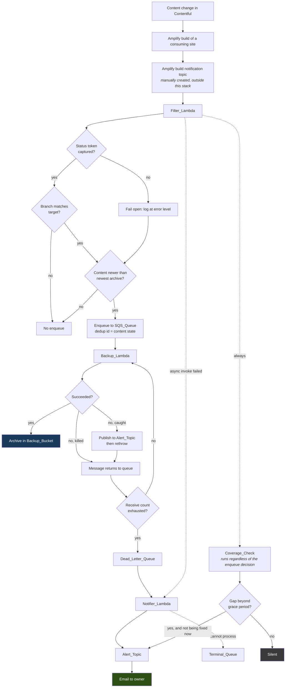

# Design Document

> **Status: pass 1 of 4.** This pass covers the overview, the component architecture, the end-to-end event flow, and the notification topology — including the encrypted-topic question that Requirement 6.3 obliges the design to settle rather than leave to verification. Passes 2–4 cover the Coverage_Check, the backup pipeline, and the infrastructure, deployment, cost and quota tables.

## Overview

The system's purpose is unchanged: when content changes in Contentful, export it and store an archive in S3. What changes is that failure becomes visible, the archive becomes trustworthy, and neither of those costs a recurring charge or a unit of Contentful quota.

Three properties drive every decision below, and they are in tension:

1. **A failure must reach the owner by email, and nothing else may.** No CloudWatch alarms, metrics, metric filters or dashboards exist to fall back on — Requirement 11 forbids them all — so the notification paths are load-bearing rather than supplementary.
2. **Contentful quota is scarce and shared.** A backup runs only for a real content change. Nothing is scheduled, nothing is synthetic, and monitoring may not call Contentful at all.
3. **Recurring AWS cost is zero at rest.** Every mechanism below is chosen from the options that carry no standing charge, and where the free option is unavailable the exception is quantified rather than absorbed.

The resulting architecture adds one small function, one SNS topic, one queue, and one comparison. It removes considerably more than it adds: an entire class of silent-success behaviour, and the observability infrastructure the review originally proposed.

## Components

| Component | Status | Role |
|---|---|---|
| `Filter_Lambda` | existing, extended | Evaluates an Amplify build notification, decides whether a backup is warranted, and performs the Coverage_Check |
| `Backup_Lambda` | existing, substantially changed | Exports the space, archives it, uploads it, verifies it, and self-reports its own caught failures |
| `Notifier_Lambda` | **new** | Formats and publishes failure notifications for the two cases the Backup_Lambda cannot report itself |
| `Alert_Topic` | **new** | Standard SNS topic carrying failure and coverage-gap email to the owner |
| `SQS_Queue` | existing, reconfigured | Serialises backup requests; retention corrected so redelivery can occur |
| `Dead_Letter_Queue` | existing, now a trigger | Receives exhausted messages and invokes the Notifier_Lambda |
| `Terminal_Queue` | **new** | Catches messages the Notifier_Lambda itself cannot process, so a poison message cannot block the notification group |
| `Backup_Bucket` | existing, hardened | Stores archives; its listing is also the Coverage_Check's second input |
| `Suppression_Store` | **new** | One SSM Parameter Store standard parameter holding coverage-gap notification state |

Three functions, not two, is a deliberate cost: the Notifier exists because a function that has been killed for a timeout or an out-of-memory condition cannot report anything about itself, and those are exactly the failure classes a growing Contentful space produces.

## End-to-end flow

Two paths in that diagram are new and carry the whole design's weight. The **`D -. async invoke failed .-> R`** edge is how a Filter_Lambda that fails outright — including one running placeholder code — becomes an email. The **`CC`** branch is how the *absence* of a backup becomes an email without a schedule and without a Contentful call.

## Notification topology

### Three publishers, one topic, one email per condition

| Path | Publisher | Fires when | Suppression |
|---|---|---|---|
| Caught backup failure | `Backup_Lambda` | Any failure it can catch, on first delivery only | `ApproximateReceiveCount == 1` |
| Uncatchable backup failure | `Notifier_Lambda` | A message reaches the Dead_Letter_Queue | Once per message, by queue semantics |
| Filter invocation failure | `Notifier_Lambda` | Async retries exhausted on the Filter_Lambda | Lambda's own retry exhaustion |
| Coverage gap | `Filter_Lambda` | Content newer than newest archive, past grace | `Suppression_Store` |

The `ApproximateReceiveCount` gate is the detail that makes the caught-failure path honest. Requirement 3 requires redelivery so the dead-letter path can engage, but a naive publish-on-every-catch would email once per attempt and then once more from the Notifier — four emails for one broken backup. The receive count arrives on the SQS record, so the gate needs no state and no extra call.

### Why the async destination is a function, not the topic

Requirement 8.2 routes the Filter_Lambda's `OnFailure` destination to the `Notifier_Lambda` rather than directly to the `Alert_Topic`. Two reasons, and the second only became apparent while resolving the encryption question below.

The stated reason is legibility. Lambda's asynchronous invocation record is a nested JSON envelope whose `requestPayload` field contains the entire original Amplify event; SNS email delivery renders that raw. The one useful field is buried, and **the record contains no log stream identifier at all**, so this path structurally cannot satisfy the content contract in criterion 7.11. Routing through a function that formats the message fixes both.

The unanticipated reason is that it keeps every publisher an IAM role. Had the destination been the topic, an AWS *service* principal would publish to it — and for service principals AWS documents that a customer-managed key is **required**, because the AWS-managed key's policy cannot be edited to grant them access. That would have forced a cost the design is trying to avoid. The indirection through the Notifier avoids it as a side effect.

### Resolving the encrypted-topic question

Requirement 6.3 obliges this design to settle, before implementation, whether every publisher can publish to a topic encrypted under the AWS-managed key — because if not, the only failure-detection channel in the system does not work, and the alternatives both cost something.

**What is established.** A publisher to an SSE-enabled SNS topic needs `kms:GenerateDataKey*` and `kms:Decrypt` on the topic's key in addition to `sns:Publish`. AWS's own documented example grants exactly that **through an IAM identity policy on the publisher**, which is the shape available to us. Two constraints qualify it: KMS requires the key's full ARN in an identity policy's `Resource` rather than an alias; and the AWS-managed key's policy cannot be edited, which is what forces a customer-managed key for service principals.

**Why that combination is awkward here.** The `alias/aws/sns` key's ARN is account- and region-specific and is not resolvable by any CloudFormation intrinsic — there is nothing to `!Ref`. So a literal ARN would have to be looked up per account and passed in as a parameter, which is precisely the kind of undocumented manual step Requirement 33 exists to eliminate.

**Chosen approach, in order of preference.** The template grants the three roles `kms:GenerateDataKey*` and `kms:Decrypt` with `Resource: "*"` constrained by a `kms:ViaService` condition naming the region's SNS endpoint. That scopes the grant by service rather than by key, needs no lookup, and costs nothing. It is the form criterion 7.12 requires.

Because AWS's documentation asks for a full key ARN, this is the one grant in the design whose sufficiency is asserted rather than proven, and it is therefore gated: **criterion 10.1's test publication is the acceptance test for it**, performed at commissioning before any reliance is placed on the channel. If it fails, the fallbacks in descending preference are:

1. **Pass the resolved `aws/sns` key ARN as a template parameter.** Still free; costs one documented manual lookup per account, recorded in the deployment procedure.
2. **A customer-managed key.** Resolvable via `!GetAtt`, policy editable, and it would also re-permit a direct service-principal destination. Costs roughly **$1/month**, which is a stated exception to zero-at-rest and reopens the deferral recorded in criterion 42.10. KMS *request* volume is immaterial — SNS reuses a data key for five minutes and this topic publishes only on failure, so requests round to zero.
3. **An unencrypted topic.** Free and certain to work, but reopens the audit finding criterion 39.2 acknowledges. The message body carries no credentials, so the exposure is a compliance gap rather than a live one.

The decision record required by criterion 56.3 records whichever of these the commissioning test selects, with its cost.

### What no path covers

Stated here because criterion 11.12 requires the residual risk to be explicit rather than discovered.

The system is observed **only when an Amplify build occurs**. A chain broken upstream of the `Filter_Lambda` — a wrong or deleted Amplify topic, a removed subscription, a notification whose format changed such that no build ever matches — produces no invocation, and therefore no failure and no coverage gap. Nothing detects it until the next build of either consuming site.

Two things bound this rather than eliminate it. Frontend deployments happen independently of content changes and are likely more frequent, so the observation window is probably shorter than the interval between backups. And the `Filter_Lambda`'s own async failure path catches everything that reaches the function and fails, including placeholder code, which is the largest single case.

A broken notification path is likewise self-concealing: if the SNS subscription lapses or the Notifier breaks, failures go quiet. The compensating control is the manual check in criterion 10.10, deliberately **not** on a calendar interval, because a recurring verification email would be the routine traffic the whole design exists to avoid.

## Decisions recorded in this pass

| Decision | Rationale | Cost |
|---|---|---|
| Three functions rather than two | A killed function cannot report itself; timeout and OOM are the classes a growing space produces | One small function, invoked only on failure |
| Async destination is the Notifier, not the topic | The raw invocation record is unreadable and carries no log stream; and it keeps every publisher an IAM role, avoiding the service-principal CMK requirement | One `lambda:InvokeFunction` grant |
| `ApproximateReceiveCount == 1` gate | Redelivery is required for the dead-letter path but must not multiply email | None — the value is on the record |
| Identity-policy KMS grant scoped by `kms:ViaService` | No key ARN to resolve, no lookup, no charge; gated on the commissioning test | Zero, if it works |
| Terminal queue behind the Dead_Letter_Queue | A constant message group means one poison message would otherwise block every subsequent notification for the full retention period | Zero at rest |
| SSM standard parameter as the suppression store | The only free durable option; the alternatives need permissions the IAM criteria forbid, or pollute the listing the Coverage_Check reads | Zero |

## Open items carried into later passes

- **Pass 2** must specify the listing algorithm, the key pattern, the three-outcome contract, and the grace and skew arithmetic — including the rule that an invocation closing a gap must not also report it.
- **Pass 3** must specify how asset completeness is derived from the filesystem rather than from the export's return value, which does not contain it.
- **Pass 4** must produce the two tables the requirements demand: per-item recurring cost against retrieved prices, and the per-content-change Contentful request budget. It must also resolve the `Filter_Lambda` time budget, which now contains a fetch with retries, an S3 listing and possibly two publishes.
