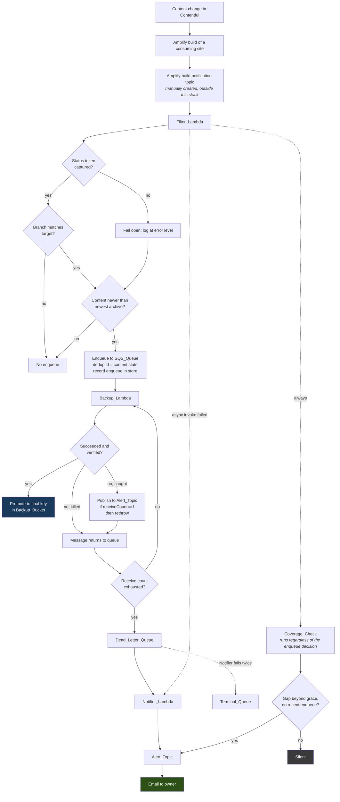

# Design Document — Backup Reliability and Modernisation

> **Single consolidated design.** Earlier drafts were written as five appended passes with a "supersedes earlier passes" clause; five parallel audits showed that clause does not help a reader who consults only one section. This document folds every correction in place, so no section contradicts another and no statement is live-but-overridden-elsewhere. The five audit reports are preserved under `docs/analysis/design-audit-2026-09-19/`.
>
> **The governing discipline, stated once and applied throughout:** every factual error the audits found was a claim that was true, or true of an earlier version, re-used without re-grounding against current AWS behaviour or library source. Where this document states an AWS or library fact, the task derived from it must re-verify against source or current docs, not against this prose.

## Overview

The system's purpose is unchanged: when content changes in Contentful, export it and store an archive in S3. What changes is that failure becomes visible, the archive becomes trustworthy, and neither of those costs a recurring charge or a unit of Contentful quota.

Three constraints drive every decision, and they are in tension:

1. **A failure must reach the owner by email, and nothing else may.** No CloudWatch alarms, metrics, metric filters or dashboards exist to fall back on — Requirement 11 forbids them all — so the notification paths are load-bearing rather than supplementary.
2. **Contentful quota is scarce and shared.** A backup runs only for a real content change. Nothing is scheduled, nothing is synthetic, and monitoring may not call Contentful at all.
3. **Recurring AWS cost is essentially zero at rest.** Every mechanism is chosen from the options with no standing charge; the one residual is SQS long-poll request volume, which sits inside the free tier and is quantified in the cost table rather than asserted away.

The architecture adds one small function, one SNS topic, two queues, one SSM parameter, three log groups, and one comparison. It removes considerably more than it adds: an entire class of silent-success behaviour, and the alarm-and-metric observability infrastructure the review originally proposed.

## Components

| Component | Status | Role |
|---|---|---|
| `Filter_Lambda` | existing, extended | Evaluates an Amplify build notification, decides whether a backup is warranted, and performs the Coverage_Check |
| `Backup_Lambda` | existing, substantially changed | Exports the space, archives it, uploads it to a staging key, verifies it, promotes it, and self-reports its own caught failures |
| `Notifier_Lambda` | **new** | Formats and publishes failure notifications for the three failure classes the Backup_Lambda cannot report itself, plus the Filter's async-invoke failure |
| `Alert_Topic` | **new** | Standard SNS topic carrying failure and coverage-gap email to the owner |
| `SQS_Queue` | existing, reconfigured | Serialises backup requests; retention corrected so redelivery can occur |
| `Dead_Letter_Queue` | existing, now a trigger | Receives exhausted messages and invokes the Notifier_Lambda |
| `Terminal_Queue` | **new** | Receives messages the Notifier_Lambda itself cannot process, so a poison message cannot block the notification group |
| `Backup_Bucket` | existing, hardened | Stores archives; its listing is also the Coverage_Check's second input |
| `Suppression_Store` | **new** | One SSM Parameter Store standard parameter holding coverage-gap notification state |

Three functions, not two, is a deliberate cost: the Notifier exists because a function killed for a timeout, an out-of-memory condition, or an initialisation failure cannot report anything about itself, and those are exactly the classes a growing Contentful space produces.

## End-to-end flow



Two paths carry the whole design's weight. The **`D -. async invoke failed .-> R`** edge is how a Filter_Lambda that fails outright — including one running placeholder code — becomes an email. The **`CC`** branch is how the *absence* of a backup becomes an email without a schedule and without a Contentful call. Note the terminal-queue edge originates at the **Dead_Letter_Queue**, not the Notifier: SQS moves a message there via the DLQ's own redrive policy after the Notifier fails to process it, and the Notifier holds no `sqs:SendMessage`.

## Notification topology

### Publishers, and one email per condition

| Path | Publisher | Fires when | De-duplication |
|---|---|---|---|
| Caught backup failure | `Backup_Lambda` | Any failure it can catch, on first delivery only | `ApproximateReceiveCount == 1` |
| Uncatchable backup failure (timeout, OOM, init) | `Notifier_Lambda` | A message reaches the Dead_Letter_Queue | Once per message, by queue semantics |
| Filter invocation failure | `Notifier_Lambda` | Async retries exhausted on the Filter_Lambda | Lambda's own retry exhaustion |
| Coverage gap | `Filter_Lambda` | Content newer than newest archive, past grace, no recent enqueue | `Suppression_Store` |

The `ApproximateReceiveCount == 1` gate makes the caught-failure path honest: redelivery is required so the dead-letter path can engage, but publishing on every catch would email once per attempt plus once from the Notifier. The count is on the SQS record, so the gate needs no state and no extra call. The attribute is documented as *approximate*, so the exact guarantee is "one caught-path email in the normal case; in the rare event the count reads 1 twice, at most two, plus the one DLQ email" — with `maxReceiveCount` bounded to 2 the pathological worst case is three emails, which is why an exact per-message bound is not claimed and no per-`messageId` state is introduced to chase one.

### Why the async destination is a function, not the topic

The Filter_Lambda's `OnFailure` destination is the `Notifier_Lambda`, not the `Alert_Topic` directly. Two reasons.

The stated reason is legibility. Lambda's asynchronous invocation record is a nested JSON envelope whose `requestPayload` field contains the entire original Amplify event; SNS email delivery renders that raw, the one useful field buried, and the record carries no log stream identifier — so it cannot satisfy the content contract in criterion 7.11. A function that formats the message fixes both.

The second reason emerged from the KMS analysis below: routing through a function keeps every publisher an IAM role. Had the destination been the topic, an AWS *service* principal would publish to it, and AWS requires a customer-managed key for service principals because the AWS-managed key's policy cannot be edited to admit them. The indirection avoids that cost as a side effect, and is worth preserving for that reason as well as legibility.

### The encrypted topic — settled, not deferred

Requirement 6.3 obliges the design to settle before implementation whether every publisher can publish to a topic encrypted under the AWS-managed key, because that channel is the only failure detection in the system.

**It can, and the sufficiency is established rather than asserted.** AWS documents that all AWS-managed keys carry a `kms:ViaService` condition in their own (uneditable) key policy admitting every in-account identity whose request arrives through the owning service; the publisher's identity policy is the other half of a same-account union. A publisher needs `kms:GenerateDataKey*` and `kms:Decrypt` in addition to `sns:Publish`.

The grant is scoped to `arn:${AWS::Partition}:kms:${AWS::Region}:${AWS::AccountId}:key/*` with a `kms:ViaService` condition naming the region's SNS endpoint — **not** `Resource: "*"`, which a template lint flags as an over-grant and which would reach every SNS-accessible key in the account. There is no key ARN to resolve and nothing to look up, so no manual per-account step. This is the form criterion 7.12 requires.

The commissioning publication (criterion 10.1) is a **smoke test** of this grant, not a coin-flip, and it must be performed **by each of the three publishing roles**, not by the operator's credentials, or it proves nothing. If it fails, the ranked fallbacks are: (1) pass the resolved `aws/sns` key ARN as a parameter — free, one documented lookup; (2) a customer-managed key — resolvable via `!GetAtt`, roughly **$1/month** (a stated exception to zero-at-rest, reopening the deferral in criterion 42.13), KMS request volume immaterial since SNS reuses a data key for five minutes and this topic publishes only on failure; (3) an unencrypted topic — free, reopening a compliance gap, message body carrying no credentials. The decision record (criterion 56.3) records whichever the smoke test selects.

### What no path covers

Stated here because criterion 11.12 requires the residual risk explicit rather than discovered.

The system is observed **only when an Amplify build occurs**. A chain broken upstream of the `Filter_Lambda` — a wrong or deleted Amplify topic, a removed subscription, a notification format changed so no build matches — produces no invocation, so no failure and no coverage gap, until the next build of either consuming site. Frontend deployments happen independently of content changes and are likely more frequent, so the observation window is probably shorter than the interval between backups; and the Filter's async-failure path catches everything that reaches the function and fails, including placeholder code.

A broken notification path is self-concealing: if the subscription lapses or the Notifier breaks, failures go quiet. The compensating control is the manual check in criterion 10.10 — performed at commissioning and after any change to a notification path, deliberately **not** on a calendar interval, because a recurring verification email would be the routine traffic the design exists to avoid — and that check includes reading the Terminal_Queue depth, which is the only observable signal that notification is broken (Requirement 11 forbids the alarm that would watch it).

---

## The Coverage_Check

One comparison, performed inside the `Filter_Lambda` on every invocation: *content changed at time T — does a verified archive exist whose export began after T?* Neither input touches Contentful, which is the whole reason this exists rather than a scheduled probe backup. The content timestamp comes from the Last_Update_API; the archive timestamp from one S3 listing.

### Key, not `LastModified`

The archive timestamp is parsed from the object **key**, not read from `LastModified`. The key is derived from `new Date()` at the start of the handler, before the export runs; `LastModified` is set when the upload completes, later by the whole export-plus-transfer duration. A content change at 10:00 with an export spanning 09:59→10:02 is **not in that archive** — a key comparison (09:59 < 10:00) correctly flags a gap; a `LastModified` comparison (10:02 > 10:00) wrongly reports it covered. The key basis is also immune to storage-class transitions, restores and re-uploads, and removes a `LastModified`-mutation question the audit could not resolve. The key format is therefore load-bearing and is documented under criterion 13.3.

### The content timestamp: max across both sites

The Last_Update_API is each website's own build output, so it is produced by the very pipeline the check audits. If one site's build breaks, its JSON freezes at the last good timestamp and the space would read covered forever. The Filter therefore reads the timestamp as the **maximum across both consuming sites' endpoints**, from two fixed template parameters — one broken build cannot freeze the comparison. A payload whose own build/publish timestamp predates the notifying build's start is treated as **stale**: logged, and the enqueue side fails open rather than trusting it. The URLs are fixed parameters, deliberately not derived from the notification — deriving them would compare a feature branch's content against production's archives and manufacture false gaps.

### The listing algorithm

```js
const ARCHIVE_KEY = /^\d{4}\/\d{2}\/\d{2}\/\d{4}-\d{2}-\d{2}_\d{2}-\d{2}-\d{2}\.\d{3}Z\.zip$/;
const MIN_SIZE = /* documented floor, well below any real archive */;
const MAX_PAGES = 5;                      // ~5,000 keys, then indeterminate

async function newestArchive(s3, bucket, prefix) {
  let token, pages = 0, best = null;
  do {
    const page = await s3.send(new ListObjectsV2Command({
      Bucket: bucket, Prefix: prefix, MaxKeys: 1000, ContinuationToken: token,
    }));
    for (const o of page.Contents ?? []) {
      if (!ARCHIVE_KEY.test(o.Key)) continue;        // excludes .partial.zip and staging keys
      if (o.Size < MIN_SIZE) continue;               // a truncated object does not cover
      if (best === null || o.Key > best.Key) best = o;
    }
    token = page.IsTruncated ? page.NextContinuationToken : undefined;
  } while (token && ++pages < MAX_PAGES);

  if (token)          return { state: 'indeterminate', reason: 'listing exceeded MAX_PAGES' };
  if (best === null)  return { state: 'none' };
  const at = timestampFromKey(best.Key);
  if (!Number.isFinite(at))
                      return { state: 'indeterminate', reason: 'unparseable key timestamp' };
  return { state: 'found', at, key: best.Key };
}
```

Six properties, each deliberate:

- **A configurable prefix.** The listing takes a prefix parameter (criterion 9.19). It is what lets the verification in criterion 10.4 manufacture a coverage gap by pointing at an empty prefix, without deleting an archive — the sanctioned route, since no role holds delete permission.
- **A flat listing, no delimiter, no prefix walk.** S3 returns keys in UTF-8 binary order (a general-purpose-bucket guarantee; directory buckets do not offer it, and this is a general-purpose bucket), and the fixed-width zero-padded key makes byte order equal chronological order, so the greatest conforming key is the newest archive. One archive per backup, a few weeks to months between changes, three-year retention → roughly 25–75 objects, two orders of magnitude below one 1,000-key page. **One request, while nothing else is written to the bucket** — which holds because access logging targets a *different* bucket. The *bounded backward* prefix walk is forbidden by name: after a long quiet period it returns nothing and would report a broken path as `indeterminate`.
- **The anchored pattern is not decoration**, and it already excludes both `.partial.zip` and any staging key: `/…\.\d{3}Z\.zip$/` matches neither. It must not be relaxed to un-anchored, and a unit test asserts both exclusions.
- **A minimum-size filter.** A verification-failed archive that somehow reached a final key, or any truncated object, does not read as covering (see the staging-and-promote flow in the pipeline section — in normal operation a bad archive never reaches a final key at all).
- **Glacier and Deep Archive objects are visible** in a plain listing with usable `Size`, `LastModified` and `StorageClass`, no restore needed; an archive in cold storage still participates.
- **`s3:ListBucketVersions` is deliberately withheld** (criterion 9.18), so noncurrent versions and delete markers are invisible — an expired archive correctly leaves the view — and incomplete multipart uploads never appear.

### Three outcomes

| Outcome | Meaning | Behaviour |
|---|---|---|
| `found` | A conforming, adequately-sized key exists and its timestamp parses | Compare its key timestamp against the content timestamp |
| `none` | The listing **succeeded** and no such key exists | Archive timestamp is negative infinity — a **determinate gap**, subject to grace |
| `indeterminate` | The listing failed, the page bound was exceeded, the key timestamp did not parse, or no content timestamp could be derived | Log the reason, **do not notify** |

The distinction between an empty listing (`none` — determinate, actionable, correct on a first deployment) and a failed listing (`indeterminate` — silent) is what resolves the empty-bucket contradiction: an empty bucket plus a real content change notifies; an inability to check does not.

### The decision, in order

```
1. Validate the event envelope.   Zero records → throw (async → Notifier → email).
                                  A present but unrecognised record body → fail open, no email.
2. Capture the build status.      Single anchored regex with a capture group, against the body.
3. Derive the branch.             Leftmost DNS label of the app URL, Amplify-sanitised.
4. Fetch both Last_Update_APIs.   Bounded timeout + retries + status + shape + staleness → contentTs | unusable
5. List the bucket.               → found(at) | none | indeterminate
6. Decide the enqueue.            See table.
7. Decide the coverage email.     See below.
8. Record enqueue in the store    (if step 6 enqueued), and one structured log line.
```

Steps 4 and 5 run regardless of branch and status — they cost no Contentful quota and the coverage question is independent of whether this build warrants a backup.

**Enqueue** (skew tolerance is applied identically here and in the coverage comparison, so the two never disagree):

| Status captured | Branch matches | Content ts | Newest archive | Enqueue? |
|---|---|---|---|---|
| success | yes | usable | older than content − skew | **yes** |
| success | yes | usable | newer | no — already covered |
| success | yes | unusable | a verified archive within grace | no — fail-open suppressed |
| success | yes | unusable | older, or none | **yes** — fail open |
| success | **no** | — | — | no — wrong branch (Coverage_Check still runs) |
| not success | yes | — | — | no |
| **not captured** | yes | — | as above | **yes** — fail open |

**Coverage email** — notify when all hold:

- outcome is `found` with key timestamp older than `contentTs − skew`, **or** outcome is `none`;
- `now − contentTs > gracePeriod`;
- the store shows **no enqueue for this content state within the grace period** (this is the correction below);
- the store shows no notification for this content state within the re-notify interval.

Equal timestamps count as covered. The skew tolerance is bounded to seconds (NTP scale) and is explicitly **not** the mechanism for build-artefact staleness, which the staleness guard above handles.

### Stateful, grace-bounded suppression — the fix for the worst failure

The dangerous earlier design suppressed the coverage email on *any* invocation that enqueued, reasoning the enqueue closes the gap. It does not close the gap; it *intends* to. Break the path between enqueue and a stored archive — mapping disabled after a first deployment, mapping mis-wired, reserved concurrency zero, FIFO group wedged, placeholder code live — and: SQS accepts the message, the Filter stays silent because it enqueued, the backup never runs, the next build repeats it. **No backup, ever, and no email, ever** — the caught path needs the function to execute, the DLQ path needs deliveries to exhaust, and under a broken mapping neither happens.

The suppression is therefore **time-bounded via the store**, whose value is:

```json
{ "notifiedContentChange": "…", "notifiedAt": "…", "enqueuedContentChange": "…", "enqueuedAt": "…" }
```

An enqueue records `enqueuedContentChange`/`enqueuedAt`. The coverage email is suppressed for a content state only if an enqueue for that state was recorded **within the grace period**. A working pipeline closes the gap inside that window and the key advances past the content timestamp, so no email is ever sent; a broken pipeline is reported one grace period later. This also covers the genuine backup-in-flight case, which is exactly an enqueue within grace.

Because the value now has two independently-written sub-records and SSM has no compare-and-swap, the read-modify-write is **last-write-wins across two writers**, and the residual is stated rather than assumed away: a lost `enqueuedAt` can cause one spurious gap email, a lost `notifiedAt` one duplicate. Both fail toward *extra* email, never toward silence, and both are bounded by the re-notify interval. The requirement's "at most one email" is amended to "at most one per re-notify interval, plus at most one extra under a concurrent-write race", and the reason (no CAS on the chosen free store; DynamoDB would give CAS at the cost of a resource this workload does not otherwise need) is recorded. A `PutParameter` failure after a successful publish is logged and swallowed, never thrown — a throw would itself email. An initial or unparseable store value is treated as "no suppression", logged at error level.

### Suppression store — why SSM

Requirement 9.16 needs state surviving between invocations weeks apart, and every alternative was rejected for a concrete reason:

| Option | Why not |
|---|---|
| S3 marker object | Needs `s3:PutObject`/`s3:GetObject` the IAM criteria forbid, and the marker key pollutes the listing the check reads |
| SQS deduplication | Fixed 5-minute window — useless across builds weeks apart |
| Ephemeral storage | Lost on a cold start, and this function is always cold |
| DynamoDB | Gives CAS, but adds a resource and a cost line for a guarantee this workload does not need |
| Object tagging | Needs write to archives, against the immutability intent, and there is nothing to tag in the fail-open case |
| Function tags / env vars | CloudFormation-managed — a write is drift and gets reverted |

An SSM **standard** parameter is free at rest and at standard throughput, survives cold starts, and needs `ssm:GetParameter`/`ssm:PutParameter` on one ARN. Parameter Store keeps the 100 most recent versions and auto-deletes the oldest (safe, since no version is labelled), so per-enqueue writes do not accumulate.

### Test surface

The comparison is a **pure function** returning both the enqueue decision and the coverage decision, taking all inputs it needs: `(contentTs, archiveOutcome, now, grace, skew, statusCaptured, branchMatches, storeState)`. That signature — wider than the earlier six-input version, which could not evaluate the enqueue-correlation condition criteria 47.7 and 47.10 test — makes every Requirement 47 criterion a unit test with no AWS, and lets the criterion 49.5 property test explore the full timestamp ordering including equality and skew. The cases that must fail before they pass: a long-quiet space with an old archive stays silent however long; an empty bucket with a real change notifies after grace; a failed listing stays silent; an unparseable key stays silent; and an invocation whose enqueue is recent does not also notify, while one whose enqueue is older than grace does.

---

## The Backup Pipeline

### Phase model

Every failure carries the phase that produced it, which turns "the backup failed" into an actionable email and lets criterion 17.6 distinguish a quota problem (remedy: wait) from every other failure (remedy: investigate).

| Phase | Fails when | Quota spent |
|---|---|---|
| `parameters` | SSM read fails, or KMS denies decryption | none |
| `tokens` | Either token is absent or empty after parsing | none |
| `export` | Contentful unavailable, unauthorised, or rate-limiting | **yes** |
| `assets` | Expected asset files missing or the wrong size | yes, already spent |
| `archive` | Archive creation fails, or `/tmp` is exhausted | yes, already spent |
| `upload` | S3 rejects the staging upload after in-invocation retries | yes, already spent |
| `verify` | The staged object is absent or the wrong size | yes, already spent |
| `promote` | The copy from staging to final key fails | yes, already spent |

The two zero-quota phases come **first**, deliberately: a missing token used to surface as an opaque Contentful auth error after the export had already spent quota; validating both tokens before the export makes a misconfiguration free. Errors are thrown, never returned — a throw is what returns the message to the queue and makes the dead-letter path, and therefore notification, reachable. `sendResponse` survives only on the success return; the prior spec's requirement to return it is the change that entrenched the silent-success defect, reversed by criterion 0.2.

### Working-directory lifecycle

```
/tmp/backup/<invocation-id>/   ← export writes here; archived
/tmp/out/<name>.zip            ← archive written here, OUTSIDE the archived tree
```

- **Per-invocation subdirectory**, so a warm environment's archive contains exactly one export rather than a cumulative superset of every earlier one.
- **Swept on entry, not only cleaned on exit.** A `finally` block does not run when Lambda kills the environment for a timeout or OOM — the classes the Notifier exists for — and unique directory names mean leaked trees accumulate rather than overwrite until `/tmp` fills. So on entry, remove anything under `/tmp/backup`, then create this invocation's directory.
- **Archive written outside the tree it archives**, so a process killed between writing and unlinking cannot leave a `.zip` that the next invocation nests into a new archive.

### Export configuration

- **`includeDrafts` removed**, which is what activates the delivery token: the library builds a Content Delivery API client only when a delivery token is present *and* drafts are excluded. Entries and assets then come from the CDA (a separate rate-limit allowance, off the CMA that editorial work and the two builds compete for); content types, editor interfaces, locales and webhooks stay on the CMA. Criterion 14.4's fail-fast is load-bearing because the library validates only the management token, so a missing delivery token would otherwise fall back silently to a draft-inclusive CMA export.
- **Tags — verify at commissioning before finalising.** The library source and its README disagree on whether tags export when a delivery token is supplied. The commissioning export runs with and without the delivery token, counts tags in each, and records the result; if the published-state switch drops tags, the switch is reconsidered, because losing tags is a data-loss regression from a change presented as a pure win.
- **`includeExperienceOrchestration: false`**, unless a measured need is recorded. It defaults **true** in v8, adding six Experience-Orchestration entity sets plus roles and releases — roughly thirteen CMA task groups, not five — which would increase per-change requests and break criterion 0.6 across the upgrade. The manifest `counts` enumerates every entity type actually exported. Note roles and webhooks are skipped when the environment is not `master`, so a non-master backup silently omits them.
- **`maxAllowedLimit` parameterised at its current 200, not raised.** The API maximum and library default are both 1000, so raising it looks like a free fivefold cut in paged requests — but the binding constraint is Contentful's hard 7,340,032-byte response-size ceiling, whose documented remedy is to *lower* this value; the ceiling depends on entry size, not count. 200 is an empirically-derived working value. A response-size error is a throw → redelivery → another export, so guessing too high spends *more* quota and loses the backup. The value is a parameter (default 200, ceiling 1000) with adaptive halving to a floor of 50 on a size error, and the commissioning export records the largest limit that succeeds for this space — established by a **single** run at a high configured value that halves and reports where it settles, not a search across values, so it stays within the one-export authorisation.
- **`useVerboseRenderer: true`**, so the library emits one line per event rather than a carriage-return-redrawn task list that becomes one JSON log envelope per redraw. The volume reduction is measured, not assumed.

### Asset reconciliation

The library classifies a failed asset download as a **warning** and filters warnings out of its throw condition, so an archive missing every binary asset resolves normally and prints success. The counts it computes are set on its internal task context and discarded — the promise resolves with content data alone — so they cannot be read from the return value, and hooking the internal log emitter is rejected as undocumented internal API.

Completeness is derived from the filesystem instead. The returned content data lists every asset with its URL **and its expected byte size** (`asset.fields.file[locale].details.size`), and the library writes each to a URL-derived path. One directory walk compares actual size against expected:

```js
const expected = new Map();
for (const asset of result.assets ?? []) {
  for (const file of Object.values(asset.fields?.file ?? {})) {
    if (!file?.url) { /* count as an error, not skipped — the library treats a ur〜less file as one */ continue; }
    const u = new URL(file.url.startsWith('//') ? `https:${file.url}` : file.url);
    expected.set(path.join(exportDir, u.host, decodeURIComponent(u.pathname)),
                 { id: asset.sys?.id, size: file.details?.size });
  }
}
const missing = [], wrongSize = [];
for (const [p, meta] of expected) {
  const st = await stat(p).catch(() => null);
  if (!st) missing.push(meta);
  else if (st.size !== meta.size) wrongSize.push(meta);   // a failed download leaves a 0-byte file; a stall leaves a partial
}
```

This corrects the earlier "existence only" check, which would have read every failed download as a zero-byte file in a `missing` bucket that stayed empty, and passed a stalled partial as complete. That single walk satisfies the shortfall count, the manifest asset counts, and the zero-byte check together.

A shortfall attributable to **rate limiting** notifies without throwing and records `complete: false` in the manifest — the library already retried each asset three times with backoff, so a fourth attempt from a fresh export is the most expensive and least likely option. Any **other** shortfall throws, because redelivery is a genuine retry.

### Staging upload, verify, promote

This is the flow that keeps a rejected archive from ever satisfying the Coverage_Check, and it preserves the no-delete stance.

```
archiver → stream → lib-storage Upload → <staging-prefix>/<name>.zip
      → verify staged object (ListObjectsV2 on the exact staging key: present, size matches bytes sent)
      → CopyObject staging → final key
      → verify final, then the staged object is left to a short-TTL lifecycle rule on the staging prefix
```

- The archive is streamed to a **staging prefix the Coverage_Check ignores**. Only a verified archive is copied to a final, coverage-visible key. A verification-failed or partial archive never lands under a conforming key, so it cannot mask a gap — without any role holding `s3:DeleteObject`.
- `CopyObject` needs `s3:GetObject` on the **staging prefix only**. This narrows the no-`GetObject` rule to "no `GetObject` on the archive (final) prefix", and criterion 50.8's test narrows to match. It is a smaller widening than a delete grant, which is what the owner chose.
- The staging objects are reaped by a short-TTL `Expiration` lifecycle rule scoped to the staging prefix — no delete permission on any role, and they are outside the archive prefix so they never enter the listing.
- **Streaming** replaces the old read-whole-archive-into-a-Buffer-then-copy path; peak memory is bounded by `partSize × queueSize` (~20 MB at defaults) plus the export object, not by archive size. `lib-storage` sends a single `PutObject` below `partSize` and multipart above, so "multipart" is not guaranteed for a small archive.
- **The export result is released before archiving.** Reconciliation runs first and extracts only the expected-size map and the counts; the reference to `result` is dropped before the archive is built, satisfying criterion 16.3 without losing the asset list.
- **In-invocation upload retry** wraps the whole `Upload`, re-creating the read stream each attempt (a consumed stream uploads zero bytes), so a transient upload failure does not cost another Contentful export.

**Verification is existence-and-size, by `ListObjectsV2` on the exact key** — not `HeadObject`, which needs `s3:GetObject` that the no-`GetObject`-on-archive-prefix rule withholds. On the checksum: S3 *does* support a whole-object checksum on a multipart upload (CRC64NVME, the default), so the earlier "composite, cannot compare" reasoning was wrong; verification stays size-based for a different reason — reading the stored checksum back needs a `GetObject`-family permission the design withholds. The manifest claims no digest.

### The manifest

Written at the archive root before archiving:

```json
{
  "manifestVersion": 1,
  "space": "<space id>", "environment": "master",
  "exportScope": "published-only",
  "exportStartedAt": "2026-09-19T14:06:01.123Z",
  "contentFile": "content.json",
  "counts": { "entries": 0, "assets": 0, "contentTypes": 0, "editorInterfaces": 0,
              "locales": 0, "tags": 0, "webhooks": 0, "roles": 0, "releases": 0 },
  "assetDownloads": { "expected": 0, "present": 0, "missing": 0, "wrongSize": 0 },
  "complete": true,
  "contentfulExportVersion": "<resolved version>",
  "commit": "<git sha of the deployed code>"
}
```

`exportScope` records that unpublished work is absent by design; `complete: false` is how an archive accepted under the rate-limit rule announces it is partial; `contentFile` is a fixed name so there is no ambiguity about the authoritative file; `commit` is why criterion 31.2 records the deployed commit as a function **tag** rather than an env var, which CloudFormation would revert. `counts` enumerates every entity type actually exported, so a non-master or ExO-disabled backup is self-describing.

### Envelope and sizing — a two-pass deployment

`MemorySize` is 450 today — a value the workload has already outgrown, since the largest current backup consumes **~950 MB**, so the existing function is being OOM-killed on its largest runs or those runs have simply never succeeded. That is consistent with the review's finding that backups fail silently, and it disposes of the "450 is unexplained" note: 450 is not a tuned value, it is a stale one.

The `~950 MB` figure also corrects an earlier interim guess. Streaming makes the *upload* independent of archive size, but two things stay memory-resident and dominate regardless: the entire `contentful-export` result object (held until asset reconciliation extracts from it) and the archiver's in-memory work while it builds the zip. So the interim `MemorySize` must sit comfortably above the known 950 MB peak, not near it — **1536 MB** interim, not 1024, because 1024 leaves only ~74 MB over a measured peak and would OOM on the very first commissioning run, failing the deploy everything downstream depends on.

`EphemeralStorageSize` is unset today (512 MB default), and the current code fits in it — but the current code's `/tmp` profile (export tree plus a fully-materialised zip read back into memory) is not this design's (export tree, a streamed zip that need not fully materialise, and a staged-then-promoted archive kept on disk until upload confirms). The two are similar and 512 MB is *probably* enough, but "the old design fits" does not prove "this design fits", so the interim is a safe **2048 MB** (ephemeral storage above 512 MB bills at fractions of a cent per run) and the commissioning export measures the real number down.

The final values come from the **one-time commissioning export** (criterion 0.7), which runs on the deployed function — so the design deploys with these interim values first, the export measures the real envelope, and a **second stack update** sets the finals. This two-pass sequence is stated so a task list can order it.

**A trend obligation, not just a point measurement.** ~950 MB against a 900 s timeout, on a space that is growing, is close enough to Lambda's ceilings (10240 MB memory, 900 s on-demand timeout) that a single point reading is not enough. The commissioning export SHALL record actual peak memory and duration, and the decision record SHALL flag whether either is past ~70% of its ceiling — the signal that the space will silently outgrow Lambda within a foreseeable horizon and that the delivery path (Step Functions, or ECS, as the original review's cost analysis contemplated) needs revisiting *before* it fails, not after. This is the same silent-growth-into-failure the whole specification exists to end, applied to the compute envelope rather than the backup logic.

---

## Infrastructure, Deployment, Cost and Quota

All prices below were retrieved from the AWS Price List API for `eu-central-1` on 2026-09-19.

### Resource inventory

This is the authoritative list. 25 resources.

| Resource | Type | New / changed |
|---|---|---|
| `BackupLambdaFunc` | `AWS::Lambda::Function` | changed — runtime, memory, storage, concurrency, logging |
| `FilterLambdaFunc` | `AWS::Lambda::Function` | changed — memory, timeout, concurrency, logging |
| `NotifierLambdaFunc` | `AWS::Lambda::Function` | **new** |
| `BackupLambdaRole`, `FilterLambdaRole` | `AWS::IAM::Role` | changed — fixed names removed, grants reconciled |
| `NotifierLambdaRole` | `AWS::IAM::Role` | **new** |
| `BackupLogGroup`, `FilterLogGroup`, `NotifierLogGroup` | `AWS::Logs::LogGroup` | **new** — IA class, bounded retention |
| `SQSQueue` | `AWS::SQS::Queue` | changed — retention, SSE, name, redrive |
| `DeadLetterQueue` | `AWS::SQS::Queue` | changed — SSE, name, redrive to Terminal_Queue |
| `TerminalQueue` | `AWS::SQS::Queue` | **new** — no consumer |
| `BackupSqsMapping` | `AWS::Lambda::EventSourceMapping` | changed — gated by `EventSourceMappingEnabled` |
| `DlqNotifierMapping` | `AWS::Lambda::EventSourceMapping` | **new** — BatchSize 1, gated |
| `FilterInvokeConfig` | `AWS::Lambda::EventInvokeConfig` | **new** — `OnFailure` → Notifier |
| `AlertTopic` | `AWS::SNS::Topic` | **new** — standard, SSE |
| `AlertSubscription` | `AWS::SNS::Subscription` | **new** — condition-gated on `SubscribeAlertEmail` |
| `SuppressionParameter` | `AWS::SSM::Parameter` | **new** — standard tier |
| `BackupBucket` | `AWS::S3::Bucket` | changed — lifecycle, ownership, `UpdateReplacePolicy`; **no** access logging |
| `BackupBucketPolicy` | `AWS::S3::BucketPolicy` | **new** — TLS + SSE-header denial |
| `SQSQueuePolicy`, `DeadLetterQueuePolicy`, `TerminalQueuePolicy` | `AWS::SQS::QueuePolicy` | **new** — non-TLS denial, per queue |
| `FilterSNSTrigger` | `AWS::Lambda::Permission` | unchanged — Amplify topic → Filter |
| `SNSSubscription` | `AWS::SNS::Subscription` | unchanged — Filter subscribes to the Amplify topic |
| `ReplicationRole` + destination bucket policy | `AWS::IAM::Role` etc. | **condition-gated, not created by default** |

Access logging and its destination bucket are **deliberately excluded** (Requirement 38) — the resource table carries no `LoggingConfiguration` on `BackupBucket`, and a test asserts its absence.

### Parameters

`AlertEmail`, `SubscribeAlertEmail` (default true; a validation stack sets it false), `TargetBranch`, `LastUpdateUrlPrimary`, `LastUpdateUrlSecondary`, `CoverageGracePeriodMinutes`, `ClockSkewToleranceSeconds`, `ReNotifyIntervalHours`, `MaxAllowedLimit`, `MaxReceiveCount`, `CoverageMinObjectSizeBytes`, `LogRetentionDays`, `NoncurrentVersionRetentionDays`, `TransitionDays`, `LongTermStorageClass`, `EventSourceMappingEnabled`, `EnableReplication`, `EnableObjectLock`, plus the replication-destination and Object-Lock-retention values. **Every parameter that exists only to support the two optional features carries a default**, so the template's required-parameter set (those without defaults) contains none of them — a disabled feature can never become a deployment prerequisite, and a test asserts it. Every numeric parameter is bounded per Requirement 42; `LogRetentionDays` uses `AllowedValues` from the set CloudWatch Logs accepts.

There is **no `BackupRetentionDays`**: current versions are never expired (below), so retention of current archives is unconditional and needs no parameter.

Outputs: bucket name, all three queue URLs, all three function names, the alert topic ARN — the build script reads the function names from the stack rather than a duplicated `.env`.

### Lifecycle — current versions are never expired

Criterion 34.9 requires the newest archive retained unconditionally, and S3 lifecycle has no "newest object" predicate. Rather than reach for object tagging (a grant no role holds, against the immutability intent), the configuration simply **does not expire current object versions at all**. It expires **noncurrent** versions after `NoncurrentVersionRetentionDays`, removes expired delete markers, and aborts incomplete multipart uploads after one day (orphaned parts are billed indefinitely and are invisible to `ListObjectsV2`, so nothing else would ever see them). A short-TTL expiry on the staging prefix reaps staged copies.

At 8–25 backups a year of tens of megabytes, current-version storage grows a few gigabytes a decade — the transition to `LongTermStorageClass` at `TransitionDays` (default 60) keeps the cost negligible. `NoncurrentVersionRetentionDays` is bounded so no permitted value places an object in Glacier Flexible Retrieval for less than its 90-day minimum given the transition day — i.e. a floor near 150 days — which closes the early-deletion charge. This is *slow, bounded-by-lack-of-churn* growth rather than *expiry-bounded* growth, and the decision record says so plainly.

### Log-group migration

The existing groups were created implicitly, outside the stack, never-expire. The template declares **new** groups at stack-scoped names (`/aws/lambda/${AWS::StackName}/backup`) in the Infrequent Access class, and the functions point at them via `LoggingConfig.LogGroup` — so the name collision that would fail `resource import` never arises, and the IA class (immutable after creation, and foreclosed by import) is available. IA halves ingestion; its lack of metric filters and EMF makes criteria 11.3/11.5 self-enforcing; its one real cost is that `GetLogEvents`/`FilterLogEvents` do not work, so criterion 7.11's notification carries a Logs Insights query — avoiding the `pattern`, `diff`, `filterIndex` and `unmask` commands IA does not support — rather than a bare stream name. The residual manual step is stated: the two orphaned old groups accrue storage until deleted by hand, which is outside CloudFormation because a stack cannot delete what it does not own.

### Conditional features are strictly inert when off

`!If [Cond, value, !Ref 'AWS::NoValue']` removes the property entirely rather than setting a falsy value, so with both conditions false the rendered template equals today's — no diff, no update action. Criterion 36.4 forbids **creating** a new resource as well as modifying one, so the replication role and destination policy are condition-gated too. Object Lock, corrected: both `ObjectLockEnabled` and `ObjectLockConfiguration` are *Update requires: No interruption* and enablement-in-place on an existing bucket is supported, so the literal `BucketName` is no obstacle and criterion 36.4 is achievable. The two real constraints are irreversibility (cannot be disabled once on) and a conflict with the lifecycle — an Object Lock retention longer than `NoncurrentVersionRetentionDays` silently disables noncurrent expiry — so the lock retention is bounded against it and a test asserts it. `UpdateReplacePolicy: Retain` on the bucket is the separate one-line guard against a `BucketName` change targeting the bucket for deletion.

### IAM, per role

- **Backup:** the three SQS actions on the source queue (`ReceiveMessage`, `DeleteMessage`, `GetQueueAttributes`) **retained** — the event source mapping polls with the execution role, they are the `AWSLambdaSQSQueueExecutionRole` body, and removing them detaches the trigger; a test asserts their presence. Plus `s3:PutObject` and `s3:AbortMultipartUpload` on the bucket; `s3:GetObject` on the **staging prefix only** (for `CopyObject`); `s3:ListBucket` for verification and promotion; `ssm:GetParameters` on both token parameters (conditional KMS decrypt for a customer-managed key); `sns:Publish` + the `kms:ViaService`-scoped KMS actions; its own log group.
- **Filter:** `sqs:SendMessage`; `s3:ListBucket` (not `s3:ListBucketVersions`); `lambda:InvokeFunction` on the Notifier; `ssm:GetParameter`/`ssm:PutParameter` on the one suppression parameter; `sns:Publish` + KMS; its own log group.
- **Notifier:** DLQ consumption; `sns:Publish` + KMS; its own log group.

No role holds `s3:GetObject`/`s3:GetObjectVersion` on the **archive** prefix — criterion 50.8 tests this across all roles. No logs action uses an account-wide wildcard resource.

### Deployment — local, reproducible, gated

The build script keeps calling `UpdateFunctionCode`. It: refuses on a dirty tree; runs `npm ci --omit=dev` (the `--os`/`--cpu` flags select optional deps but do **not** cross-compile, so the commissioning deploy asserts the function starts on arm64); packages from an explicit **allow-list** (`.gitignore` protects git, not the zip — a stray `backup-lambda/.env` would otherwise ship a management token); refuses if `node_modules` is absent or a credential file matched; calls `UpdateFunctionCode(..., Publish: true)`; records the commit as a function **tag** (an env var is CloudFormation-managed and would be reverted); prunes published versions to 3 (Lambda code storage is a **quota** — 300 GB/region, fails deploys when exhausted — not a charge). No alias: CloudFormation cannot manage one pointing at `$LATEST`, and a script-managed alias reintroduces the drift this removes. The placeholder **throws**, so a first deployment runs with `EventSourceMappingEnabled: false` and enables the mappings after code is applied — except the Notifier placeholder, which **publishes** "code never applied" rather than throwing, so it fails open (it is the terminus of every failure path, and on a first deploy all three functions are placeholders).

### Cost table

| Item | Unit price (eff. date) | Volume | Monthly |
|---|---|---|---|
| Lambda compute, arm64 | $0.0000133334/GB-s (2026-09-01) | 3 functions, tens of invocations | < $0.01 |
| Lambda ephemeral storage, arm64 | $0.0000000367/GB-s (2026-09-01) | above 512 MB, while running | < $0.01 |
| S3 LIST | $0.0054/1,000 (2026-09-01) | ~2 per build | < $0.01 |
| S3 PUT + CopyObject | $0.0054/1,000 | ~2 per backup | < $0.01 |
| S3 lifecycle transition requests | per-1,000, Glacier tier | 8–25/year | < $0.01 |
| SQS FIFO requests | $0.50/million (2025-08-01) | ESM long-poll — see below | **≤ ~$0.20** |
| SSM standard parameter | free | 1 | $0.00 |
| SNS email | first 1,000/month free | on failure only | $0.00 |
| **CMK contingency** | ~$1/month | only if the AWS-managed-key smoke test fails | **$0 unless triggered** |
| CloudWatch Logs ingestion, IA | $0.315/GB (2026-09-01) | reduced by the renderer change | usage-dependent |
| CloudWatch Logs / S3 archive storage | $0.0324 / $0.0245 / $0.00405 per GB-mo | bounded by retention / lifecycle | usage-dependent |
| **Total new recurring, at rest** | | | **≤ ~$0.20/month** |

**The SQS free-tier dependency, named per criterion 11.10 and corrected from the earlier estimate.** A Lambda SQS event source mapping runs **2–5 concurrent long-pollers**, not one. Two enabled mappings at a 20-second poll are therefore **0.5 M–1.3 M `ReceiveMessage`/month**, against a perpetual **1 M/month** free tier — so at the documented five-poller start the pair may sit *just above* the allowance, exposure under **$0.20/month** at $0.50/million. It is free *because of the allowance*, not because it is zero; a poller count is an AWS implementation detail, so this is an estimate to confirm against the first month's bill. The Terminal_Queue has no consumer, so it adds no polling.

Log ingestion, log storage and archive storage are usage-dependent and excluded by name in criterion 57.5. Archive storage is what grows, and the lifecycle (noncurrent expiry, delete-marker removal) is what bounds the *versioning* liability the old config left unbounded.

### Contentful request budget (criterion 57.6)

| Path | Before | After |
|---|---|---|
| Filter — last-update check ×2 | 0 (static site) | 0 |
| Filter — Coverage_Check | — | 0 (S3 only) |
| Backup — content model (CMA) | ~5–7 calls | ~5–7 calls (ExO **off**) |
| Backup — entries + assets | CMA, paged 200 | **CDA**, paged 200 (adaptive) |
| Backup — asset downloads | 1 GET/file | unchanged |
| **Per successful change** | baseline | **same call count, different endpoint** |

The one reduction is the CDA move onto a separate rate-limit allowance — real, free, and the only one claimed (the page-count cut is deferred to the commissioning measurement). ExO is turned **off** so the v8 upgrade does not add task groups and breach criterion 0.6. The one permitted increase is on the *failure* path: a thrown backup is redelivered, at most `maxReceiveCount` = 2 exports; the rate-limit case is excluded even from that, notifying without throwing. Plus the single commissioning export, counted here.

### Timing chain — the numbers, with `Timeout` corrected

| Value | Value | Basis |
|---|---|---|
| Backup `Timeout` | **900 s** | On-demand Lambda maximum. The 90-minute timeout announced 2026-09-09 requires **Lambda Managed Instances** (EC2-style capacity, breaks zero-at-rest), so on-demand's 15-minute ceiling is the real bound and 900 s is a deliberate choice within it — corrected from the earlier "the Lambda maximum", which is now false in general. |
| `VisibilityTimeout` | **5400 s** | ≥ 6 × 900 (criterion 3.3), and Lambda validates this at ESM creation |
| `MessageRetentionPeriod` | **14 days (max)** | Not the ~6 h floor: a message hitting retention is deleted with no redrive, so the max converts a silent-loss window into a fortnight during which stateful suppression surfaces the gap |
| source `maxReceiveCount` | **2** | bounded parameter; caps failure-path quota at two exports |
| DLQ `VisibilityTimeout` / `maxReceiveCount` | **60 s / 2** | bounds the FIFO head-of-line block to ~2 min before a poison message moves to the Terminal_Queue |
| DLQ mapping `BatchSize` | **1** | so one poison message cannot re-notify up to nine good ones per round |
| Filter / Notifier `Timeout` | **30 s** | Filter budget below |
| Filter / Notifier `MemorySize` | **256 MB** | explicit, covers the four-client cold start |
| Backup `ReservedConcurrentExecutions` | **1** | makes the FIFO single-group serialisation explicit |
| Filter `ReservedConcurrentExecutions` | **≥ #sites + margin** | below this a concurrent build is throttled, and a throttled async invoke emails |
| Grace period | **30 min** (5 min–24 h) | ≥ worst build + export + upload + margin; commissioning build-duration sets it |
| Skew tolerance | **5 s** (1–60 s) | NTP scale; not the staleness mechanism |
| Re-notify interval | **24 h** (1–168 h) | how often a persistent gap re-emails |
| Log retention | **90 days** | `AllowedValues` from CloudWatch's set |
| `MaxAllowedLimit` | **200** (≤1000), halve-to-50 | above |

Worst-case notification latency (criterion 3.7): a killed invocation is invisible for the full 5400 s twice, so a crash-class failure emails at **~3 hours** plus up to ~2 minutes of DLQ block; a caught failure emails in **seconds**. The 6× visibility multiplier, inherited from Prior_Spec Requirement 20, buys nothing for a *killed* invocation but is kept as an accepted cost since relaxing it touches a frozen prior requirement and crash classes are rare.

### The Filter time budget, computed

The Filter does a four-client cold start, two last-update fetches with retries, one S3 listing, one SSM read, and possibly an SNS publish and an SSM write — in 30 s. **All AWS clients get explicit `connectionTimeout`, `requestTimeout` and `maxAttempts: 2`**, not SDK defaults, because a throttled call on defaults can consume tens of seconds and a Filter timeout is an unhandled crash that emails on every slow build. The handler carries an **overall deadline** and on exhaustion **returns** — fail open, log, no email — never letting itself be killed. The two fetches share half the budget (≈ 3 s × 2 attempts + short backoff per endpoint); the other half covers the cold start and the three AWS calls.

### The routine two-thirds — mechanised by their requirements

Parts D, E, G, H and I of the requirements (the runtime/dependency upgrade, deployment validation, static analysis, CI, tests, docs, decision record, residual-code sweep) are conventional; their mechanism *is* the requirement text, and the task list draws each task straight from it. The load-bearing choices a task-writer needs are named here so they are not invented:

- **The atomic dependency change:** runtime **`nodejs24.x`** (arm64 kept); `contentful-export` the current 8.x major (resolved version confirmed against npm at task time — the repo pins `^7.19.144`); **`archiver`** (streaming) *replacing* `adm-zip`; and the `@aws-sdk/*` v3 clients declared as dependencies, not relied on from the runtime. `contentful-export` v8 ships **both** CJS and ESM (verified), so the CommonJS handler keeps working and no ESM conversion is forced into the atomic change. These four land in one commit because the library needs the newer runtime and splitting them reds the suite between commits.
- **The residual-code sweep** includes the identical dead status-code branch in `deploy/build-lambda.js` that criterion 1.4 removes from the Backup_Lambda.
- **Fixtures (Requirement 51)** include the async invocation record the Notifier must discriminate — the "no log stream identifier" claim is only holdable against a committed fixture.

### Settled vs gated on first deployment

Settled by the audits: the KMS grant (established, smoke-tested by each role), Object Lock in-place enablement, the S3 listing guarantees, the log class, the streamed upload, the CJS/ESM question. Genuinely gated on the commissioning deployment, enumerated so a task list can sequence them:

1. Final `MemorySize`/`EphemeralStorageSize`, from the measured envelope — the **two-pass deployment**.
2. Whether tags survive the published-state switch — settle before finalising it.
3. Each site's Amplify build duration, which sets the grace period.
4. The largest `MaxAllowedLimit` that succeeds — one adaptive run, not a search.
5. That each publishing role can publish under the encrypted topic's key.

The commissioning export runs **once**, through the queue, records its outputs under `docs/`, and its measurements feed the second stack update. Nothing else requires an untriggered export.
