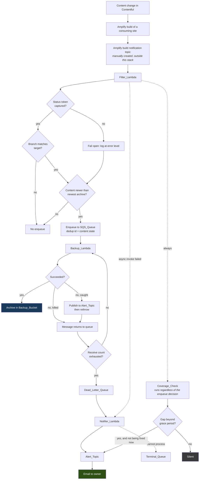

# Design Document

> **Status: pass 1 of 5.** This pass covers the overview, the component architecture, the end-to-end event flow, and the notification topology — including the encrypted-topic question that Requirement 6.3 obliges the design to settle rather than leave to verification. Passes 2–4 cover the Coverage_Check, the backup pipeline, and the infrastructure, deployment, cost and quota tables.

## Overview

The system's purpose is unchanged: when content changes in Contentful, export it and store an archive in S3. What changes is that failure becomes visible, the archive becomes trustworthy, and neither of those costs a recurring charge or a unit of Contentful quota.

Three properties drive every decision below, and they are in tension:

1. **A failure must reach the owner by email, and nothing else may.** No CloudWatch alarms, metrics, metric filters or dashboards exist to fall back on — Requirement 11 forbids them all — so the notification paths are load-bearing rather than supplementary.
2. **Contentful quota is scarce and shared.** A backup runs only for a real content change. Nothing is scheduled, nothing is synthetic, and monitoring may not call Contentful at all.
3. **Recurring AWS cost is zero at rest.** Every mechanism below is chosen from the options that carry no standing charge, and where the free option is unavailable the exception is quantified rather than absorbed.

The resulting architecture adds one small function, one SNS topic, one queue, and one comparison. It removes considerably more than it adds: an entire class of silent-success behaviour, and the observability infrastructure the review originally proposed.

## Components

| Component | Status | Role |
|---|---|---|
| `Filter_Lambda` | existing, extended | Evaluates an Amplify build notification, decides whether a backup is warranted, and performs the Coverage_Check |
| `Backup_Lambda` | existing, substantially changed | Exports the space, archives it, uploads it, verifies it, and self-reports its own caught failures |
| `Notifier_Lambda` | **new** | Formats and publishes failure notifications for the two cases the Backup_Lambda cannot report itself |
| `Alert_Topic` | **new** | Standard SNS topic carrying failure and coverage-gap email to the owner |
| `SQS_Queue` | existing, reconfigured | Serialises backup requests; retention corrected so redelivery can occur |
| `Dead_Letter_Queue` | existing, now a trigger | Receives exhausted messages and invokes the Notifier_Lambda |
| `Terminal_Queue` | **new** | Catches messages the Notifier_Lambda itself cannot process, so a poison message cannot block the notification group |
| `Backup_Bucket` | existing, hardened | Stores archives; its listing is also the Coverage_Check's second input |
| `Suppression_Store` | **new** | One SSM Parameter Store standard parameter holding coverage-gap notification state |

Three functions, not two, is a deliberate cost: the Notifier exists because a function that has been killed for a timeout or an out-of-memory condition cannot report anything about itself, and those are exactly the failure classes a growing Contentful space produces.

## End-to-end flow



Two paths in that diagram are new and carry the whole design's weight. The **`D -. async invoke failed .-> R`** edge is how a Filter_Lambda that fails outright — including one running placeholder code — becomes an email. The **`CC`** branch is how the *absence* of a backup becomes an email without a schedule and without a Contentful call.

## Notification topology

### Three publishers, one topic, one email per condition

| Path | Publisher | Fires when | Suppression |
|---|---|---|---|
| Caught backup failure | `Backup_Lambda` | Any failure it can catch, on first delivery only | `ApproximateReceiveCount == 1` |
| Uncatchable backup failure | `Notifier_Lambda` | A message reaches the Dead_Letter_Queue | Once per message, by queue semantics |
| Filter invocation failure | `Notifier_Lambda` | Async retries exhausted on the Filter_Lambda | Lambda's own retry exhaustion |
| Coverage gap | `Filter_Lambda` | Content newer than newest archive, past grace | `Suppression_Store` |

The `ApproximateReceiveCount` gate is the detail that makes the caught-failure path honest. Requirement 3 requires redelivery so the dead-letter path can engage, but a naive publish-on-every-catch would email once per attempt and then once more from the Notifier — four emails for one broken backup. The receive count arrives on the SQS record, so the gate needs no state and no extra call.

### Why the async destination is a function, not the topic

Requirement 8.2 routes the Filter_Lambda's `OnFailure` destination to the `Notifier_Lambda` rather than directly to the `Alert_Topic`. Two reasons, and the second only became apparent while resolving the encryption question below.

The stated reason is legibility. Lambda's asynchronous invocation record is a nested JSON envelope whose `requestPayload` field contains the entire original Amplify event; SNS email delivery renders that raw. The one useful field is buried, and **the record contains no log stream identifier at all**, so this path structurally cannot satisfy the content contract in criterion 7.11. Routing through a function that formats the message fixes both.

The unanticipated reason is that it keeps every publisher an IAM role. Had the destination been the topic, an AWS *service* principal would publish to it — and for service principals AWS documents that a customer-managed key is **required**, because the AWS-managed key's policy cannot be edited to grant them access. That would have forced a cost the design is trying to avoid. The indirection through the Notifier avoids it as a side effect.

### Resolving the encrypted-topic question

Requirement 6.3 obliges this design to settle, before implementation, whether every publisher can publish to a topic encrypted under the AWS-managed key — because if not, the only failure-detection channel in the system does not work, and the alternatives both cost something.

**What is established.** A publisher to an SSE-enabled SNS topic needs `kms:GenerateDataKey*` and `kms:Decrypt` on the topic's key in addition to `sns:Publish`. AWS's own documented example grants exactly that **through an IAM identity policy on the publisher**, which is the shape available to us. Two constraints qualify it: KMS requires the key's full ARN in an identity policy's `Resource` rather than an alias; and the AWS-managed key's policy cannot be edited, which is what forces a customer-managed key for service principals.

**Why that combination is awkward here.** The `alias/aws/sns` key's ARN is account- and region-specific and is not resolvable by any CloudFormation intrinsic — there is nothing to `!Ref`. So a literal ARN would have to be looked up per account and passed in as a parameter, which is precisely the kind of undocumented manual step Requirement 33 exists to eliminate.

**Chosen approach, in order of preference.** The template grants the three roles `kms:GenerateDataKey*` and `kms:Decrypt` with `Resource: "*"` constrained by a `kms:ViaService` condition naming the region's SNS endpoint. That scopes the grant by service rather than by key, needs no lookup, and costs nothing. It is the form criterion 7.12 requires.

Because AWS's documentation asks for a full key ARN, this is the one grant in the design whose sufficiency is asserted rather than proven, and it is therefore gated: **criterion 10.1's test publication is the acceptance test for it**, performed at commissioning before any reliance is placed on the channel. If it fails, the fallbacks in descending preference are:

1. **Pass the resolved `aws/sns` key ARN as a template parameter.** Still free; costs one documented manual lookup per account, recorded in the deployment procedure.
2. **A customer-managed key.** Resolvable via `!GetAtt`, policy editable, and it would also re-permit a direct service-principal destination. Costs roughly **$1/month**, which is a stated exception to zero-at-rest and reopens the deferral recorded in criterion 42.10. KMS *request* volume is immaterial — SNS reuses a data key for five minutes and this topic publishes only on failure, so requests round to zero.
3. **An unencrypted topic.** Free and certain to work, but reopens the audit finding criterion 39.2 acknowledges. The message body carries no credentials, so the exposure is a compliance gap rather than a live one.

The decision record required by criterion 56.3 records whichever of these the commissioning test selects, with its cost.

### What no path covers

Stated here because criterion 11.12 requires the residual risk to be explicit rather than discovered.

The system is observed **only when an Amplify build occurs**. A chain broken upstream of the `Filter_Lambda` — a wrong or deleted Amplify topic, a removed subscription, a notification whose format changed such that no build ever matches — produces no invocation, and therefore no failure and no coverage gap. Nothing detects it until the next build of either consuming site.

Two things bound this rather than eliminate it. Frontend deployments happen independently of content changes and are likely more frequent, so the observation window is probably shorter than the interval between backups. And the `Filter_Lambda`'s own async failure path catches everything that reaches the function and fails, including placeholder code, which is the largest single case.

A broken notification path is likewise self-concealing: if the SNS subscription lapses or the Notifier breaks, failures go quiet. The compensating control is the manual check in criterion 10.10, deliberately **not** on a calendar interval, because a recurring verification email would be the routine traffic the whole design exists to avoid.

## Decisions recorded in this pass

| Decision | Rationale | Cost |
|---|---|---|
| Three functions rather than two | A killed function cannot report itself; timeout and OOM are the classes a growing space produces | One small function, invoked only on failure |
| Async destination is the Notifier, not the topic | The raw invocation record is unreadable and carries no log stream; and it keeps every publisher an IAM role, avoiding the service-principal CMK requirement | One `lambda:InvokeFunction` grant |
| `ApproximateReceiveCount == 1` gate | Redelivery is required for the dead-letter path but must not multiply email | None — the value is on the record |
| Identity-policy KMS grant scoped by `kms:ViaService` | No key ARN to resolve, no lookup, no charge; gated on the commissioning test | Zero, if it works |
| Terminal queue behind the Dead_Letter_Queue | A constant message group means one poison message would otherwise block every subsequent notification for the full retention period | Zero at rest |
| SSM standard parameter as the suppression store | The only free durable option; the alternatives need permissions the IAM criteria forbid, or pollute the listing the Coverage_Check reads | Zero |

## Open items carried into later passes

- **Pass 2** must specify the listing algorithm, the key pattern, the three-outcome contract, and the grace and skew arithmetic — including the rule that an invocation closing a gap must not also report it.
- **Pass 3** must specify how asset completeness is derived from the filesystem rather than from the export's return value, which does not contain it.
- **Pass 4** must produce the two tables the requirements demand: per-item recurring cost against retrieved prices, and the per-content-change Contentful request budget. It must also resolve the `Filter_Lambda` time budget, which now contains a fetch with retries, an S3 listing and possibly two publishes.

---

# Pass 2 — The Coverage_Check

> **Status: pass 2 of 4.** Specifies the mechanism that detects a silently missing backup without a schedule, an alarm, or a Contentful call. Satisfies Requirement 9, and the suppression halves of Requirements 18 and 20.

## What it is

One comparison, performed inside the `Filter_Lambda` on every invocation: *content changed at time T — does an archive exist whose export began after T?* Both inputs are already available or nearly so. The content timestamp comes from the Last_Update_API, which the filter already fetches. The archive timestamp comes from one S3 listing, which is the only new call.

Neither input touches Contentful. That is the whole reason this mechanism exists rather than a scheduled probe backup.

## Why the key, not `LastModified`

The archive timestamp is parsed from the object **key**, not read from the object's `LastModified` metadata. This is the single most consequential decision in the pass, and getting it backwards would produce a check that silently under-reports.

`generateS3Key` derives the key from `new Date()` at the **start** of the handler, before the export runs. `LastModified` is set when the **upload completes**, which is later by the whole duration of the export, the archive build and the transfer.

Consider a content change at 10:00, and a backup whose export began at 09:59 and finished at 10:02. The archive **does not contain** that change — the export read Contentful before it happened. A `LastModified` comparison reports 10:02 > 10:00 and declares the change covered. A key comparison reports 09:59 < 10:00 and correctly declares a gap.

The key basis has two further virtues that fall out for free: it is unaffected by a storage-class transition, a Glacier restore or a re-upload, any of which can move `LastModified`; and it removes the need to establish whether a lifecycle transition mutates `LastModified` at all, which the feasibility review could not determine from the documentation and declined to guess at.

This makes the key format load-bearing rather than cosmetic, which is why criterion 13.3 now requires it documented alongside the manifest's content-file name.

## The listing algorithm

```js
// Anchored so nothing but an archive can be mistaken for the newest archive.
const ARCHIVE_KEY = /^\d{4}\/\d{2}\/\d{2}\/\d{4}-\d{2}-\d{2}_\d{2}-\d{2}-\d{2}\.\d{3}Z\.zip$/;
const MAX_PAGES = 5;                      // ~5,000 keys, then declare indeterminate

async function newestArchive(s3, bucket) {
  let token, pages = 0, newestKey = null;
  do {
    const page = await s3.send(new ListObjectsV2Command({
      Bucket: bucket, MaxKeys: 1000, ContinuationToken: token,
    }));
    for (const o of page.Contents ?? []) {
      if (ARCHIVE_KEY.test(o.Key) && (newestKey === null || o.Key > newestKey)) {
        newestKey = o.Key;
      }
    }
    token = page.IsTruncated ? page.NextContinuationToken : undefined;
  } while (token && ++pages < MAX_PAGES);

  if (token)             return { state: 'indeterminate', reason: 'listing exceeded MAX_PAGES' };
  if (newestKey === null) return { state: 'none' };
  return { state: 'found', at: timestampFromKey(newestKey), key: newestKey };
}
```

Four properties of that, each deliberate:

**A flat listing, no delimiter, no prefix walk.** S3 returns keys in lexicographic order, and the key format is fixed-width and zero-padded throughout, so byte order equals chronological order and the greatest conforming key is the newest archive. The object count makes this cheap and keeps it cheap: one archive per backup, content changing every few weeks to months, and a three-year retention gives roughly 25–75 objects — two orders of magnitude below the 1,000-key page limit. **One request, permanently.**

A greedy prefix descent (max year → max month → max day) would cost four requests to save nothing, and only wins above ~1,000 objects. Worse, the *bounded backward* variant — "list today, then yesterday, back N days" — is actively dangerous here: after a legitimate months-long quiet period it returns nothing, which the three-outcome contract below would have to treat as indeterminate, and a genuinely broken backup path would be reported as "cannot check". That is the worst available outcome, and it is the specific design this section exists to forbid.

**The anchored pattern is not decoration.** "The last key in the bucket" equals "the newest archive" only if nothing else lives there. Anything sorting after a digit — a manifest written at the root, a marker object, a stray prefix — would silently become the newest archive and mask every real gap. The pattern is anchored at both ends and the filter is applied before the comparison.

**Glacier and Deep Archive objects are visible.** `ListObjectsV2` returns `Key`, `Size`, `LastModified` and `StorageClass` for every current object regardless of class, and no restore is needed to read metadata. An archive that has transitioned to cold storage still participates in the comparison, which it must, since most archives will have.

**Versioning works in our favour, and `s3:ListBucketVersions` is deliberately withheld.** `ListObjectsV2` returns current versions only. Noncurrent versions and delete markers require a different API gated by a different permission, which criterion 9.18 does not grant. So when the lifecycle rule places a delete marker over an expired archive, that key leaves the check's view — which is correct, because the archive is gone. Incomplete multipart uploads are likewise absent from a general-purpose bucket listing, so a half-finished upload cannot masquerade as a backup.

## Three outcomes, not two

The earlier draft had a two-way split — determinable or not — and it produced a direct contradiction: an empty bucket has no archive timestamp, so it read as "cannot determine" and stayed silent, while the test requirement demanded that an empty bucket plus a real content change must notify. Both were right about their own case and wrong together.

| Outcome | Meaning | Comparison behaviour |
|---|---|---|
| `found` | A conforming key exists | Compare its key timestamp against the content timestamp |
| `none` | The listing **succeeded** and no conforming key exists | Treat the archive timestamp as negative infinity: a **determinate gap**, subject to the grace period |
| `indeterminate` | The listing failed, or the page bound was exceeded, or no content timestamp could be derived | Log the reason and **do not notify** |

The distinction that matters is between an empty listing and a failed listing. An empty listing is information — there is no backup — and on a first deployment, or after every archive has expired, it is the correct and actionable answer. A failed listing is an absence of information, and notifying on it would make an inability to check into recurring email, which is the failure mode criterion 9.9 exists to prevent.

## The decision, in order

```
1. Validate the event envelope.          Zero records → throw (async retries → Notifier → email).
                                          Malformed record body → fail open, no notification.
2. Capture the build status.             Anchored regex on the message body.
3. Derive the branch.                    Leftmost DNS label of the app URL, Amplify-sanitised.
4. Fetch the Last_Update_API.            Timeout, retries, status check, shape validation.
                                          → contentTs  |  unusable
5. List the bucket.                      → found(at) | none | indeterminate
6. Decide the enqueue.                   See table below.
7. Decide the coverage notification.     See table below.
8. Emit one structured log line.         Every input, both decisions, and the reasons.
```

Steps 4 and 5 run **regardless of the branch and regardless of the status**, because they cost no Contentful quota and because the coverage question is independent of whether this particular build warrants a backup.

### A subtlety that is easy to get wrong later

The Last_Update_API URL is a **fixed template parameter**. It is not derived from the notification. So the filter always reads the same endpoint — production's — no matter which branch's build triggered the invocation.

This is what makes running the Coverage_Check on a non-matching branch meaningful rather than misleading. A feature-branch build publishes its own last-update JSON, and if the URL were derived from the notification the check would be comparing a feature branch's content state against production's archives, producing false gaps. Deriving the URL from the notification looks like a natural improvement and would break the check; the parameter is deliberate.

### Enqueue

| Status captured | Branch matches | Content timestamp | Newest archive | Enqueue? |
|---|---|---|---|---|
| success | yes | usable | older than content | **yes** |
| success | yes | usable | newer than content | no — already covered |
| success | yes | unusable | newer than `now − grace` | no — fail-open suppressed |
| success | yes | unusable | older, or none | **yes** — fail open |
| success | **no** | any | any | no — wrong branch |
| not success | yes | any | any | no |
| **not captured** | yes | any | as above | **yes** — fail open |

Two different suppression rules appear there, and the difference is not arbitrary. When a content timestamp is **usable**, suppression compares against it — that is the deduplication guarantee of criterion 20.2, extended past SQS's fixed five-minute window to an indefinite one, at no cost, using a listing already performed. When the content timestamp is **unusable**, there is nothing to compare against, so suppression falls back to recency: was there a backup within the grace window? That is criterion 18.10, and it works because the *previous* fail-open produced an archive that this invocation can see.

### Coverage notification

Notify when **all** hold:

- the outcome is `found` with a key timestamp older than `contentTs − skewTolerance`, **or** the outcome is `none`
- `now − contentTs > gracePeriod`
- this invocation is **not** enqueueing a backup for this same content state
- the suppression store does not already record a notification for this content state within the re-notify interval

Otherwise, silence.

The third condition is the one the earlier draft forbade. A criterion requiring the check to run "independently of the backup-required decision" was read as prohibiting any correlation with it — so a build slower than the grace period would both enqueue a backup and email a gap for the identical change, in the same invocation. That is email during entirely normal operation. The criterion now requires the check to *run* regardless, which was its real intent, while permitting the one correlation that keeps the guarantee true.

Equal timestamps count as covered. The two clocks are independent — one is Contentful's, surfaced through a static build artefact; the other is the backup function's `new Date()` — so a skew tolerance is subtracted from the content timestamp before comparison, and it is a bounded parameter rather than a constant.

## Suppression state

Requirement 9.16 needs state that survives between invocations weeks apart. The earlier draft demanded it while the IAM criteria forbade every store capable of holding it — the defect an audit caught as structural rather than local.

**One SSM Parameter Store standard parameter**, holding a small JSON value:

```json
{ "lastNotifiedContentChange": "2026-09-19T14:06:01.123Z", "lastNotifiedAt": "2026-09-19T18:12:44.900Z" }
```

Notify when the content-change timestamp differs from `lastNotifiedContentChange`, or when `lastNotifiedAt` is older than a bounded re-notify interval. Write after a successful publish.

Standard parameters are free, and standard throughput is free, so this is zero at rest. Concurrency is last-write-wins: two frontends building at the same time write near-identical values, so the race is benign and needs no conditional write. It survives a cold start, which rules out ephemeral storage — the filter fires weeks apart, so its environment is always cold and `/tmp` is effectively write-only.

The rejected alternatives, recorded so they are not revisited:

| Option | Why not |
|---|---|
| S3 marker object | Needs `s3:PutObject`, which criterion 40.6 forbids, and `s3:GetObject`, which 40.9 forbids; trips the encryption-header policy in criterion 37.2; and the marker key pollutes the very listing the check reads |
| SQS deduplication | Fixed five-minute window. Useless across builds weeks apart — this is the gap criterion 20.6 records |
| Ephemeral storage | Lost on a cold start, and this function is always cold |
| DynamoDB | Correct, and conditional writes give real atomicity — but it adds a resource and a cost line to argue about for guarantees this workload does not need |
| Object tagging | Needs write access to archives, works against the immutability intent of Requirement 36, and there is no object to tag in the fail-open case |
| Function tags or environment variables | CloudFormation-managed, so a write registers as drift and is reverted — the same trap criterion 31.2 avoids for the commit identifier |

**On whether re-notification is routine traffic.** It is not. A digest reports on a period; this reports that a specific unresolved condition still holds and action is still required. Criterion 7.14 forbids the former, and criterion 57.13's "no email during normal operation" does not apply because an uncovered content change is not normal operation. The re-notify interval exists so a persistent gap stays visible without arriving on every build.

## Cost

| Item | Per build | At rest |
|---|---|---|
| `ListObjectsV2` | 1 request | — |
| SSM `GetParameter` | 1 request (standard throughput, free) | — |
| SSM `PutParameter` | only when notifying | — |
| Standard parameter storage | — | **$0** |
| SNS publish | only when notifying; within the free email allowance | — |

The S3 listing is the only item with a unit price, charged in the LIST request tier. Criterion 57.4 requires the figure to come from the Price List API rather than from this document, so pass 4 retrieves it and puts it in the cost table. At one request per build of either site, it is immaterial but not zero, and criterion 57.5 requires it accounted for in the cost table.

## Test surface

Requirement 47's twelve criteria map onto the boundaries above. The comparison is extracted as a **pure function** of `(contentTs, archiveOutcome, now, grace, skew, suppressionState)`, which makes every one of them a unit test with no AWS involved — and makes the property test in criterion 49.5 able to explore the full timestamp ordering, including equality and skew, without a fixture.

The cases that must fail before they pass: a quiet space with a very old archive and no content change must stay silent *however long* the period is; an empty bucket with a real change must notify once the grace has elapsed; a failed listing must stay silent; and an invocation that enqueues must not also notify.

---

# Pass 3 — The Backup Pipeline

> **Status: pass 3 of 4.** Specifies the `Backup_Lambda` end to end: the phase model, the working-directory lifecycle, the export configuration, asset reconciliation, the streamed upload, and the manifest. Satisfies Requirements 1, 12–17.

## The phase model

Every failure carries the phase that produced it. This is what turns "the backup failed" into an email an operator can act on without opening a console, and it is what lets criterion 17.6 distinguish a quota problem — whose remedy is *wait* — from every other failure, whose remedy is *investigate*.

| Phase | Fails when | Quota spent |
|---|---|---|
| `parameters` | SSM read fails, or KMS denies decryption | none |
| `tokens` | Either token is absent or empty after parsing | none |
| `export` | Contentful is unavailable, unauthorised, or rate-limits | **yes** |
| `assets` | Expected asset files are missing or truncated | yes, already spent |
| `archive` | Archive creation fails, or `/tmp` is exhausted | yes, already spent |
| `upload` | S3 rejects the upload after in-invocation retries | yes, already spent |
| `verify` | The stored object is absent or the wrong size | yes, already spent |

The ordering is not incidental: the two phases that cost nothing come **first**. A missing token used to surface as an opaque Contentful authentication error after the export had already begun consuming quota; validating both tokens before the export means a misconfiguration costs nothing. That is what criterion 14.4 means by describing itself as load-bearing rather than defensive.

Errors are thrown, never returned. A thrown error is what makes the invocation fail, which is what makes the message return to the queue, which is what makes the dead-letter path and therefore the notification reachable at all. The `sendResponse` helper survives only on the success return, if at all — the prior specification's requirement to return it was the change that entrenched the silent-success defect, and criterion 0.2 reverses it by name.

## Working-directory lifecycle

```
/tmp/backup/<invocation-id>/     ← export writes here; archived
/tmp/out/<archive-name>.zip      ← archive written here; OUTSIDE the archived tree
```

Three rules, each closing a distinct defect:

**A per-invocation subdirectory.** The old code exported into a fixed `/tmp/backup` and archived the whole directory. On a warm execution environment that made every archive a cumulative superset of every earlier export on that container — several content files with nothing to say which was authoritative, assets since deleted from Contentful still present, and prior error logs included. A unique path per invocation makes each archive contain exactly one export.

**A sweep on entry, not only a cleanup on exit.** Removing the working directory in a `finally` block handles a thrown error. It does **not** handle a timeout or an out-of-memory kill, because Lambda terminates the execution environment without unwinding — and those are precisely the two classes the `Notifier_Lambda` exists to report. Without a sweep, each such failure leaks a full export tree, and because the directory name is unique those trees accumulate rather than overwrite, until ephemeral storage fills and every subsequent invocation on that container fails for a reason no criterion anticipated. So: on entry, remove anything already under `/tmp/backup`; then create this invocation's directory.

**The archive is written outside the tree it archives.** Within a single invocation the ordering happens to be safe — the archiver enumerates before the output file exists — but across invocations it is not: a process killed between writing the archive and unlinking it leaves a `.zip` that the next invocation's enumeration picks up, nesting an entire previous archive inside the new one. Writing to a sibling directory removes the possibility rather than relying on ordering.

## Export configuration

Four changes, three of which reduce Contentful consumption.

**`includeDrafts` removed.** This is what activates the delivery token. The library constructs a Content Delivery API client only when a delivery token is present *and* drafts are excluded; with drafts included, the token is fetched from SSM, decrypted, passed in, and silently ignored. With it removed, entries and assets come from the CDA while content types, editor interfaces, locales, tags and webhooks continue to come from the CMA. Both tokens are genuinely required, and criterion 14.4's fail-fast becomes load-bearing because the library validates only the management token — a missing delivery token would otherwise fall back to a draft-inclusive CMA export without complaint.

This also shifts the heaviest part of the load onto an endpoint with a **separate rate-limit allowance**, which is a direct win for the constraint that editorial work and two frontend builds compete for the same CMA quota.

**`maxAllowedLimit` parameterised at its current value, not raised.** This one was nearly a mistake, and the reasoning is worth preserving because the naive reading is attractive and wrong.

The API's maximum for `limit` is 1000, the library defaults to 1000, and neither is plan-dependent — so raising 200 to 1000 looks like a fivefold cut in paged requests for free. It is not free. Contentful enforces a hard **response-size ceiling of 7,340,032 bytes**, and the documented remedy for exceeding it is to *lower* this value; a Contentful maintainer's advice on the relevant issue is to try 100. The ceiling is a function of entry **size**, not count, so a space with large rich-text entries reaches it well below 1000 entries.

`200` is therefore to be read as an empirically-derived working value, not an oversight. And the failure mode if it is raised too far compounds in the wrong direction: a response-size error is a throw, which is redelivered, which costs *another* export — so guessing wrong spends more quota than the smaller pages would have, and loses the backup as well.

So: the value becomes a **parameter defaulting to 200**, bounded at 1000. The function additionally handles a response-size error by **halving the effective page limit and retrying**, down to a floor, so a higher configured value degrades gracefully rather than failing. The commissioning export records the largest limit that actually succeeds for this space, and only then is raising the default a decision with evidence behind it.

This is the same discipline the rest of the design applies to sizing: measure, then set, rather than set and hope.

**`useVerboseRenderer` set true.** Counter-intuitively, `false` selects a renderer that redraws the whole task list in place with carriage returns on every tick — and under JSON log formatting each redraw becomes its own log envelope. The verbose renderer emits one line per event. Criterion 5.10 requires the resulting volume reduction measured rather than assumed.

**Tokens validated before the export.** Per the phase table above.

## Asset reconciliation

The defect this replaces is the quietest one in the system: the library classifies a failed asset download as a **warning**, and filters warnings out of the condition it throws on. So an archive missing every binary asset resolves normally, prints "The export was successful", and is uploaded and recorded as a good backup. The failure surfaces only at restore.

The obvious fix does not work. The library counts successes, warnings and errors — and then discards them: the counts are set on its internal task context while the promise resolves with the content data alone, so they reach a console table and nowhere else. An earlier draft of the requirements said to "inspect the outcome of the export's asset download stage rather than discarding the export result", which was impossible: the result never contained it. Attaching a listener to the library's internal log emitter would work and is rejected — it is undocumented internal API, and a backup system's correctness should not rest on one.

**Derive completeness from the filesystem instead.** The returned content data *does* list every asset with its URL, and the library writes each to a path derived from that URL. So the expected file set is computable, and one directory walk answers everything:

```js
// Expected: every asset URL the export returned, resolved to its on-disk path.
const expected = new Map();
for (const asset of result.assets ?? []) {
  for (const file of Object.values(asset.fields?.file ?? {})) {
    if (!file?.url) continue;
    const u = new URL(file.url.startsWith('//') ? `https:${file.url}` : file.url);
    expected.set(
      path.join(exportDir, u.host, decodeURIComponent(u.pathname)),
      { id: asset.sys?.id, url: file.url }
    );
  }
}

// One walk answers three questions.
const missing = [], truncated = [];
for (const [p, meta] of expected) {
  const st = await stat(p).catch(() => null);
  if (!st)            missing.push(meta);
  else if (st.size === 0) truncated.push(meta);
}
```

That single pass satisfies three separate criteria — the shortfall count (15.3), the manifest's asset counts (13.2), and the zero-byte check (13.7) — and depends on nothing but the documented return shape.

**What to do with a shortfall is not uniform**, and this is where an earlier draft contradicted itself: one criterion mandated an unconditional throw while another asked whether a rate-limited shortfall was worth retrying. Throwing costs a full re-export per redelivery, so the answer matters.

| Cause | Action | Why |
|---|---|---|
| Rate limiting | **Notify, do not throw.** Record the archive as incomplete in the manifest. | The library already retried each asset three times with exponential backoff. An asset that still failed has exhausted that budget, so a fourth attempt from a whole fresh export is the most expensive option and the least likely to succeed. |
| Anything else | **Throw.** | Redelivery is a genuine retry with a real chance of succeeding. |

The rate-limit case is the one where criterion 17.6 earns its place: the email says *quota*, so the operator waits rather than investigates.

## The streamed upload

```
archiver → stream → @aws-sdk/lib-storage Upload (multipart) → S3
```

The old path read the finished archive into a Buffer with `readFileSync`, then copied it again via `Buffer.from`, and held the entire export result alive in scope throughout — three full-size things resident at once against a 450 MB ceiling, with the failure mode an OOM kill, which is invisible without the Notifier. Streaming makes peak memory independent of archive size.

**One tension to resolve explicitly.** Criterion 16.3 requires the export result not held longer than needed, but asset reconciliation needs `result.assets`. The resolution: reconciliation runs first and extracts only what it needs — the expected-path map, and the counts for the manifest — and the reference to `result` is dropped before archiving begins. So the large object is alive for the reconciliation walk and not for the archive build or the upload.

**Retry inside the invocation before throwing.** A transient upload failure should not cost another Contentful export. The archive already exists locally, so the function retries the upload a bounded number of times within its remaining time, and only then throws. Each retry must **re-create the read stream** — a streaming uploader consumes it, so a reused stream uploads zero bytes silently.

**Delete the local archive only after the upload is confirmed.** The old code unlinked before uploading, so a failed upload left nothing to retry from and recovery meant re-exporting the entire space.

**Verify with a listing, not a head request.** `HeadObject` is the natural way to confirm an object's existence and size, and it requires `s3:GetObject` — which criterion 40.9 forbids, because no code path reads object contents and the exception therefore does not apply. `ListObjectsV2` scoped to the exact key returns `Key` and `Size` and needs only `s3:ListBucket`, which the function already holds for nothing else. It has a second virtue: an incomplete multipart upload does not appear in a general-purpose bucket listing, so a half-uploaded archive is correctly detected as absent rather than reported as present at the wrong size.

**On the checksum.** A multipart upload's stored checksum is a composite of part digests, not a digest of the whole object, so it cannot be compared against a locally computed whole-file hash. The manifest must not claim otherwise. Verification is therefore existence and size, and the checksum's role is transport integrity per part, which is what the SDK uses it for.

## The manifest

Written into the root of the export directory immediately before archiving, so it lands at the archive root.

```json
{
  "manifestVersion": 1,
  "space": "<space id>",
  "environment": "master",
  "exportScope": "published-only",
  "exportStartedAt": "2026-09-19T14:06:01.123Z",
  "contentFile": "content.json",
  "counts": {
    "entries": 1284, "assets": 412, "contentTypes": 23,
    "locales": 2, "tags": 11, "editorInterfaces": 23, "webhooks": 4
  },
  "assetDownloads": { "expected": 412, "present": 412, "missing": 0, "truncated": 0 },
  "complete": true,
  "contentfulExportVersion": "8.5.0",
  "commit": "<git sha of the deployed code>"
}
```

`exportScope` and `complete` are the two fields that do work a restorer cannot get elsewhere: the first records that unpublished editorial work is absent by design rather than by accident, and the second is how an archive accepted under the rate-limit rule above announces that it is partial. `contentFile` is a fixed name, so there is never ambiguity about which file is authoritative — the defect that made the old cumulative archives unusable.

`commit` is why criterion 31.2 records the deployed commit on the function as a tag: the function needs to be able to read its own provenance at runtime, and an environment variable would have been reverted as CloudFormation drift.

## Envelope and sizing

`MemorySize` is currently 450 with no justification recorded anywhere in the repository, and `EphemeralStorageSize` is unset, so `/tmp` is the 512 MB default while the function writes an entire export plus its archive there.

Both become explicit, and the basis for the numbers is the **one-time commissioning export** authorised by criterion 0.7 — the only export in this design not triggered by a content change, counted in the quota budget, and recorded in the decision record. It yields the export tree size, the archive size and the duration, from which the ephemeral storage is set with headroom and the memory is chosen against measured peak rather than guessed.

Streaming is what makes this tractable: with the upload no longer buffering, memory scales with the archiver's window rather than with the archive, so the binding constraint becomes `/tmp` — which is a declared number rather than an inherited default.

## Test surface

The pipeline's two least-testable behaviours become testable through one change each:

- **Working-directory lifecycle** — the working root is injectable, so a test points it at a scratch directory, invokes the handler twice against the same root, and asserts the second archive contains exactly one export. That single test covers the contamination defect and the cross-invocation archive nesting together, and it is impossible while `fs` and the archiver are stubbed as they are today.
- **Asset reconciliation** — a fixture export tree with a deliberately missing and a deliberately zero-byte asset, against a returned content shape listing both. This is the test that needs the export-return fixture the completeness audit found missing, and it is the one place where a wrong assumption about the library's return shape would silently re-create the original false-success defect.

Failure-path assertions use rejection, not a returned status object: `assert.rejects` on upload failure, export failure, parameter failure, token failure and verification failure. Those fail today, which is the point.

---

# Pass 4 — Infrastructure, Deployment, Cost and Quota

> **Status: pass 4 of 4.** Template structure, the log-group migration, the conditional blocks that must be inert, IAM per role, the deployment path, and the two tables Requirements 57.5 and 57.6 demand. All prices below were retrieved from the AWS Price List API for `eu-central-1` on 2026-09-19 and are quoted with their effective dates, per criterion 57.4.

## Template structure

Resources, grouped by what changes:

| Existing, reconfigured | New | Unchanged in kind |
|---|---|---|
| `BackupLambdaFunc` — runtime, memory, storage, concurrency, logging | `NotifierLambdaFunc` + role + log group | `FilterSNSTrigger` |
| `FilterLambdaFunc` — memory, timeout, concurrency, logging, invoke config | `AlertTopic` + subscription | `SNSSubscription` |
| `SQSQueue` — retention, encryption, name | `TerminalQueue` | |
| `DeadLetterQueue` — encryption, redrive, name, ESM to Notifier | `SuppressionParameter` | |
| `BackupBucket` — lifecycle, policy, ownership, logging, update-replace | `BackupLogGroup`, `FilterLogGroup`, `NotifierLogGroup` | |
| `BackupLambdaRole`, `FilterLambdaRole` — names removed, grants reconciled | | |

New parameters: `AlertEmail`, `SubscribeAlertEmail`, `TargetBranch`, `CoverageGracePeriodMinutes`, `ClockSkewToleranceSeconds`, `ReNotifyIntervalHours`, `LogRetentionDays`, `BackupRetentionDays`, `NoncurrentVersionRetentionDays`, `EventSourceMappingEnabled`, `EnableReplication`, `EnableObjectLock`, plus the replication destination and Object Lock retention values — every one of which carries a default, so neither disabled feature can become a deployment prerequisite. Every one carries a constraint per Requirement 42 — the ARNs and the URL get patterns, the numeric ones get bounds, and `LogRetentionDays` gets `AllowedValues` drawn from the set CloudWatch Logs accepts, because the service rejects arbitrary integers.

Outputs: bucket name, all three queue URLs, all three function names, the alert topic ARN. The function names matter beyond convenience — the build script reads them from the stack rather than from a duplicated `.env` value, which removes the drift where a renamed function leaves the script updating something that no longer exists.

## The log-group migration

This is the one piece of the design that cannot be made fully automatic, and the requirement says so rather than pretending otherwise.

The existing log groups were created implicitly by Lambda, outside the stack, with never-expire retention. Three ways to bring them under management, two of which fail:

- **Declare them at the default `/aws/lambda/<function>` name.** Fails on the next stack update with `ResourceAlreadyExistsException`. `DependsOn` does not help — it orders creation, it does not adopt.
- **CloudFormation resource import.** Works, but is a separate change-set operation that cannot be combined with other template changes, and the imported groups would be **permanently stuck in the Standard log class**, because a log group's class is immutable after creation.
- **Point the functions at new, stack-created groups** via `LoggingConfig.LogGroup` with a stack-scoped name. The collision never arises, and the new groups can be created directly in the Infrequent Access class.

The third is chosen. Criterion 5.4 already mandates `LoggingConfig`, so this costs nothing extra:

```yaml
BackupLogGroup:
  Type: AWS::Logs::LogGroup
  DeletionPolicy: Retain
  Properties:
    LogGroupName: !Sub '/aws/lambda/${AWS::StackName}/backup'
    LogGroupClass: INFREQUENT_ACCESS
    RetentionInDays: !Ref LogRetentionDays

BackupLambdaFunc:
  Type: AWS::Lambda::Function
  DependsOn: BackupLogGroup
  Properties:
    LoggingConfig:
      LogFormat: JSON
      ApplicationLogLevel: INFO
      LogGroup: !Ref BackupLogGroup
```

**The residual manual step, stated plainly:** the old `/aws/lambda/contentful-backup` and `/aws/lambda/amplify-notification-filter` groups are now orphaned. They hold no retention setting and will accrue storage charges indefinitely. Deleting them is outside CloudFormation by construction — a stack cannot delete a resource it does not own — so it is a one-time operation in the deployment procedure. Criterion 5.7 requires this admitted rather than glossed.

**Log class consequences, accepted deliberately.** Infrequent Access halves ingestion cost, and its restrictions are mostly things this design already forbids: no metric filters and no Embedded Metric Format, which makes criteria 11.3 and 11.5 self-enforcing. The one real cost is that `GetLogEvents` and `FilterLogEvents` do not work, so an operator cannot open a log stream directly — which is why criterion 7.11 requires the notification to carry a Logs Insights query rather than a bare stream name. Storage and query prices are identical between classes, so only ingestion differs.

## Conditional blocks that must be inert

Requirement 36 parameterises replication and Object Lock as opt-ins, and criterion 36.4 requires that with both disabled the template is a strict no-op against the currently deployed stack — no resource replaced, no property modified merely because the block exists.

The mechanism is `!If` resolving to `AWS::NoValue`, which removes the property from the request entirely rather than setting it to a falsy value:

```yaml
BackupBucket:
  Type: AWS::S3::Bucket
  DeletionPolicy: Retain
  UpdateReplacePolicy: Retain          # governs replacement; default is Delete
  Properties:
    ObjectLockEnabled: !If [ObjectLockOn, true, !Ref 'AWS::NoValue']
    ObjectLockConfiguration: !If [ObjectLockOn, {...}, !Ref 'AWS::NoValue']
    ReplicationConfiguration: !If [ReplicationOn, {...}, !Ref 'AWS::NoValue']
```

With the conditions false the rendered template is equivalent to today's, so there is no diff and no update action.

**Two details are what make "optional" actually optional**, and both are easy to get wrong in a way that only shows up when someone tries to deploy.

*Every supporting parameter carries a default.* Replication needs a destination bucket and account; Object Lock needs a retention mode and period. Declared the usual way — `Type: String`, no default — CloudFormation would **demand a value for each at deploy time even with the feature switched off**, so a disabled feature would become a deployment prerequisite. Each therefore gets a default (empty string, or a documented placeholder), and criterion 36.11 requires a test asserting that the template's required-parameter set — those without defaults — contains nothing belonging to either feature.

*Every supporting resource is gated too.* Replication needs an IAM role, and a destination bucket policy. Declared unconditionally, those exist whether or not replication is on. Criterion 36.4 therefore forbids **creating** a new resource as well as modifying an existing one, so the role and the policy carry the same condition as the configuration they serve.

Taken together with criterion 36.7 — that neither feature is a prerequisite for any other requirement, and the system produces, verifies and notifies about backups identically with both off — the features are genuinely inert when disabled rather than merely defaulted off.

**My earlier premise about Object Lock was wrong and the requirement now records the right constraints.** Both `ObjectLockEnabled` and `ObjectLockConfiguration` are documented as *Update requires: No interruption*, and enabling Object Lock on an existing bucket is supported — the old "contact AWS Support" restriction no longer applies. So the literal `BucketName` is not an obstacle and criterion 36.4 is achievable as written. The two constraints that do apply:

1. **Irreversibility.** Once enabled, Object Lock cannot be disabled and versioning cannot be suspended. A parameter that switches on but never off is not a symmetric toggle, and its description says so.
2. **A live conflict with Requirement 34.** An Object Lock default retention blocks deletion of a version until its retain-until date — including the noncurrent-version expiry that stops unbounded storage growth. Enabling Object Lock with a retention longer than the noncurrent-version period makes that expiry silently ineffective and storage resumes growing. So the Object Lock retention is constrained against the lifecycle retention, and criterion 36.9 requires a test asserting it.

`UpdateReplacePolicy: Retain` is the one-line fix worth calling out separately: `DeletionPolicy` governs only stack *deletion*, replacement is governed by `UpdateReplacePolicy`, and its default is `Delete`. Without it, a `BucketName` change would instruct CloudFormation to delete the bucket holding every archive. It would probably fail, because a non-empty versioned bucket resists deletion — but that is an accident of S3 semantics, not a control.

## IAM, per role

Three roles, no fixed names, every grant traceable to a code path or documented as deliberately retained.

**Backup function.** The three SQS actions on the source queue — `ReceiveMessage`, `DeleteMessage`, `GetQueueAttributes` — **retained**, because an SQS event source mapping polls using the function's execution role. These are the body of the AWS-managed `AWSLambdaSQSQueueExecutionRole`, and removing them detaches the trigger rather than tightening anything. Criterion 40.11 records them as deliberately retained, since they answer to the service rather than to the function's own code, and criterion 2.3 requires a test asserting their presence so a future least-privilege sweep cannot delete them again. Then: `s3:PutObject` and `s3:AbortMultipartUpload` for the streamed multipart upload; `s3:ListBucket` for the verification; `ssm:GetParameters` on both token parameters; `sns:Publish` on the alert topic with the KMS actions; and its own log group.

**Filter function.** `sqs:SendMessage` on the source queue; `s3:ListBucket` on the bucket — and deliberately **not** `s3:ListBucketVersions`, so noncurrent versions and delete markers stay invisible to the Coverage_Check; `lambda:InvokeFunction` on the Notifier for the async destination; `ssm:GetParameter` and `ssm:PutParameter` on the one suppression parameter; `sns:Publish` with KMS; its own log group.

**Notifier function.** Its queue-consumption actions on the dead-letter queue; `sns:Publish` with KMS; its own log group.

No role holds `s3:GetObject` or `s3:GetObjectVersion` on the backup bucket, because no code path reads object contents — both the Coverage_Check and the upload verification need listing only. Criterion 50.8 tests this across *all* roles rather than one, since the verification path made the backup function the likelier place such a grant would appear.

The SSM decrypt grant is `!If`-gated on whether a customer-managed key is in use. No explicit grant is needed for the default `aws/ssm` key — the key policy confers it via a `kms:ViaService` condition — so an unconditional wildcard grant would be a genuine over-grant. But re-creating those parameters under a customer-managed key is a common hardening step that would break retrieval, and under the old code that failure was swallowed. Requirements 1 and 7 are what make it visible now.

## Deployment

The model stays local, per your decision: the build script packages and calls `UpdateFunctionCode`. What changes is that it becomes reproducible and gated.

```
1. Refuse if the working tree is dirty.          → artefact always maps to a commit
2. npm ci --omit=dev --os=linux --cpu=arm64      → lockfile-faithful, target-platform
3. Package from an explicit ALLOW-LIST           → index.js, package.json, node_modules
4. Refuse if any .env or credential file matched → ignore rules protect git, not the zip
5. Refuse if node_modules is absent
6. UpdateFunctionCode(..., Publish: true)        → immutable version, one call
7. TagResource: commit=<sha>                     → survives; an env var would be reverted
8. Report the published version number
```

Four details that are load-bearing rather than stylistic:

**An allow-list, not a directory sweep.** `.gitignore` covers `.env` at any depth, which protects version control and does nothing for the zip. A developer's `backup-lambda/.env` left from local testing would be swept into the deployment package alongside a management token granting full write access to the Contentful space. An allow-list makes that impossible rather than unlikely.

**A tag, not an environment variable, for the commit.** The functions' `Environment.Variables` are CloudFormation-managed, so a script write registers as stack drift and is reverted on the next update — silently, and in a way indistinguishable from the placeholder reversion the verification exists to catch. Function tags are not stack-managed for these resources.

**`Publish: true` on the same call.** No separate publish call is needed. Criterion 31.7 bounds accumulation: published versions hold code storage permanently and are chargeable beyond the account allowance, so older versions are pruned to a documented count.

**No alias.** Rollback is "retrieve a prior version's artefact and reapply it". CloudFormation cannot manage an alias pointing at `$LATEST`, so an alias would have to be script-updated — reintroducing exactly the drift this design removes. Criterion 31.6 records the reasoning.

**The placeholder now throws.** A first deployment is therefore performed with `EventSourceMappingEnabled: false`, and the mapping is enabled after code is applied. If a later stack operation ever reinstates the placeholder — changing a function-name parameter forces replacement, which recreates from the template — the throw makes it loud instead of silent. That single character change converts the worst failure mode in the old system into the most visible one.

## Cost table

Prices retrieved from the AWS Price List API, `eu-central-1`, 2026-09-19. Volumes assume content changing every few weeks, so roughly 8–25 backups per year, and builds of two consuming frontends.

| Item | Unit price | Volume | Monthly |
|---|---|---|---|
| Lambda compute, arm64 | $0.0000133334 / GB-s | 3 functions, tens of invocations | **< $0.01** |
| Lambda requests, arm64 | $0.0000002 / request | hundreds | **< $0.01** |
| Lambda ephemeral storage, arm64 | $0.0000000367 / GB-s | above the free 512 MB, only while running | **< $0.01** |
| S3 LIST (`ListObjectsV2`) | $0.0054 / 1,000 | 1 per build + 1 per backup verification | **< $0.01** |
| S3 PUT (archive upload) | $0.0054 / 1,000 | 1 per backup, plus multipart parts | **< $0.01** |
| SQS FIFO requests | $0.50 / million | ESM polling — see below | **$0.00** *(free tier)* |
| SSM standard parameter | no charge | 1 parameter | **$0.00** |
| SNS email notifications | first 1,000/month free | only on failure | **$0.00** |
| CloudWatch Logs ingestion, IA class | $0.315 / GB | reduced by the renderer change | **usage-dependent** |
| CloudWatch Logs storage | $0.0324 / GB-month | bounded by `LogRetentionDays` | **usage-dependent** |
| S3 archive storage, Standard | $0.0245 / GB-month | first 60 days | **usage-dependent** |
| S3 archive storage, Glacier Flexible | $0.00405 / GB-month | days 60 → retention | **usage-dependent** |
| Lambda published-version code storage | within account allowance, pruned | 3 functions × retained count | **$0.00** |
| **Total new recurring, at rest** | | | **$0.00** |

**The free-tier dependency criterion 11.10 requires named.** Two event source mappings poll continuously while enabled — the source queue and the dead-letter queue. At long-poll intervals that is on the order of 130,000 `ReceiveMessage` calls per queue per month, so roughly **260,000 FIFO requests/month**, against a perpetual free tier of **1 million requests/month**. It is free, with meaningful headroom, but it is free *because of the allowance* rather than because it is zero — and if the account acquires other SQS usage the combined total is what counts. At $0.50/million the exposure past the allowance is cents, not dollars. The exact poller count is an AWS implementation detail, so this figure is an estimate to be confirmed against the first month's actual bill rather than a guarantee.

**The terminal queue has no consumer**, so it adds no polling. It exists only to receive a message the Notifier cannot process, which is why it costs nothing at rest.

Three items are deliberately usage-dependent rather than zero, and criterion 57.5 excludes them by name: log ingestion, log storage, and archive storage. Archive storage is the one that grows, and Requirement 34 is what makes it bounded — on the current configuration, expiration on a versioned bucket only writes delete markers, so **100% of "expired" archives are retained and billed indefinitely**. Adding noncurrent-version expiry converts an unbounded liability into a bounded one, which is a saving that compounds rather than a cost.

## Contentful request budget

Criterion 57.6 requires a per-content-change budget showing that consumption does not increase on the success path.

| Path | Before | After |
|---|---|---|
| Filter — last-update check | 0 *(the static site, not Contentful)* | 0 |
| Filter — Coverage_Check | — | 0 *(S3 only)* |
| Backup — content model (CMA) | ~5 calls | ~5 calls |
| Backup — entries + assets | CMA, paged at 200 | **CDA**, paged at 200 *(parameterised, adaptive)* |
| Backup — asset downloads | 1 GET per asset file | unchanged |
| **Per successful change** | **baseline** | **same call count, different endpoint** |

**One reduction, and it is not the one I first claimed.** Moving entries and assets from the Management API to the Content Delivery API shifts that load onto a **separate rate-limit allowance**, so the heaviest part of the export stops competing with editorial work and with the two frontend builds. That is a real win and it costs nothing.

**The page-count reduction is deferred, deliberately.** An earlier draft raised `maxAllowedLimit` from 200 to 1000 and claimed a fivefold cut in paged requests. The API does permit 1000 and the library defaults to it — but Contentful's hard 7 MiB response-size ceiling is the binding constraint, not the page limit, and the documented remedy for exceeding it is to *lower* this value. Since the ceiling depends on entry size rather than count, 200 is an empirically-derived working value. Raising it speculatively risks a thrown export, which is redelivered, which costs another export — spending more quota than the smaller pages would have, and losing the backup too.

So the value is parameterised at 200 with adaptive halving on a size error, and the commissioning export measures the real headroom. If it turns out 1000 succeeds for this space, the saving is available as a one-parameter change with evidence behind it.

**The one increase, bounded and stated.** Throwing on failure means a failed backup is redelivered, and each redelivery is another export. With `maxReceiveCount` bounded to 2, a failing change costs at most 2 exports rather than 1. Criterion 0.6 permits this explicitly — "shall not increase *on the success path*" — because the alternative is the silent-success behaviour this whole specification exists to remove. The rate-limit case is excluded from even that: a shortfall attributable to rate limiting notifies without throwing, so it does not retry, precisely because retrying when quota is the constraint is the worst available move.

**Plus one, once.** The commissioning export authorised by criterion 0.7, which establishes the size and duration envelope. It is the only export in the design not triggered by a content change, and it is counted here rather than hidden.

## The Filter function's time budget

Criterion 16.9 requires this computed rather than discovered. The filter now performs, in sequence: an HTTP fetch with a bounded timeout, up to two retries with backoff, one S3 listing, one SSM read, and possibly one SNS publish and one SSM write.

The budget is expressed as an invariant rather than a set of magic numbers: **total time spent on Last_Update_API requests including all retries and backoff shall not exceed half the function timeout**, leaving the remaining half for the listing, the parameter read and any publish. The per-request timeout and retry count are then derived from that ceiling and from the function timeout, rather than chosen independently and hoped to fit. The current 30-second timeout is the value to validate against the measured latency of the static endpoint; raising it violates nothing.

## What remains open after this pass

Two items are deliberately unresolved, both gated on a first deployment rather than on further design:

1. **Whether the identity-policy KMS grant suffices for the AWS-managed SNS key.** Pass 1 records the fallbacks in order. The commissioning test publication is the acceptance test.
2. **The size and duration envelope**, and therefore the final `MemorySize` and `EphemeralStorageSize` values. The commissioning export produces them.

Everything else in Requirements 0–57 now has a mechanism. The next artefact is `tasks.md`, which must respect one sequencing constraint the requirements state and a task list would otherwise violate: the runtime upgrade, the export-library major, the archive-library replacement and the streamed upload are **one atomic change**, because the library requires the newer runtime and separating them leaves the suite failing between commits.

---

# Pass 5 — Audit Corrections

> **Status: pass 5 of 5.** A four-way audit of passes 1–4 found no flaw that invalidates the architecture, but it found one composite failure that produces permanent silent loss, several library and platform claims that were true of an earlier version and carried forward, and about seventeen requirements the design named but did not give a mechanism. This pass supersedes the earlier passes wherever they conflict. The four audit reports are preserved under `docs/analysis/design-audit-2026-09-19/`.
>
> **The governing lesson, stated once:** every factual error the audit found was a claim that was true, or true of a different version, re-used without re-grounding. The one part of passes 1–4 that read the library's actual source rather than its docs — the silent-success diagnosis — is the only part with no errors. Pass 5 re-grounds; the tasks derived from it must verify against source and current docs, not against this document's prose.

## 5.1 The suppression hole — the one that produces permanent silent failure

Passes 2 and 4 suppressed the coverage-gap email whenever the same invocation enqueued a backup, on the reasoning that the enqueue closes the gap. It does not close the gap; it *intends* to. Break the path between the enqueue and a stored archive — the event source mapping left disabled after a first deployment, the mapping deleted or mis-wired, reserved concurrency at zero, the FIFO group wedged, or the backup function running placeholder code — and the sequence is: SQS accepts the message, the Filter suppresses the email because it enqueued, the backup never runs, and the next build repeats it against the same still-newer content timestamp. The result is **no backup, ever, and no email, ever**. The caught-failure path needs the function to execute; the dead-letter path needs deliveries to exhaust; under a broken mapping neither happens.

This is the failure criterion 9.10 was written to prevent — "the same invocation *is closing* the gap" — and the earlier design implemented the weaker "intends to close". The fix makes suppression stateful and time-bounded, using the suppression store that already exists:

- THE suppression store value becomes `{ notifiedContentChange, notifiedAt, enqueuedContentChange, enqueuedAt }`.
- WHEN the Filter enqueues a backup for a content state, it records `enqueuedContentChange` and `enqueuedAt`.
- THE coverage-gap notification is suppressed for a content state ONLY IF an enqueue for that same state was recorded within the grace period. Once the grace period elapses with the archive still absent, the next build notifies.

So an enqueue buys silence for one grace period, not forever. A working pipeline closes the gap inside that window and the archive's key advances past the content timestamp, so no email is ever sent. A broken pipeline is reported one grace period later — the whole point of the mechanism. This also subsumes the "backup genuinely in flight" false-positive: the in-flight backup is covered by the same grace window rather than by an unconditional veto.

This became **Requirement 9's** governing correction and the requirements are updated to match: criterion 9.10 now reads as time-bounded suppression, and the "what no path covers" section (criterion 11.12) no longer claims the enqueue path is safe.

## 5.2 Poison keys — an archive the system itself rejected still satisfies the check

The Coverage_Check's `found` outcome is a statement about a key, and a key carries no verdict. Two archives the pipeline judged bad nonetheless land a conforming key and permanently satisfy coverage:

- **The rate-limited partial archive.** Criterion 15.4 uploads it with `complete: false` rather than throwing. Its key becomes the newest, and from then on the space reads as covered — but the "wait for quota" email is a lie, because nothing retries until the next content change.
- **The verification-failed archive.** The object is in the bucket under a conforming key; no role can delete it (deliberately, Requirement 40); it suppresses detection for its content state and every earlier one.

Both are closed cheaply, using the listing the check already performs:

- A partial or unverified archive SHALL be written under a key the `ARCHIVE_KEY` pattern **excludes** — a `.partial.zip` suffix rather than `.zip`. It is still stored and still emailed, but it does not satisfy coverage, so the next build of either site re-enqueues. That is the deferred retry the "wait for quota" remedy wanted, arriving naturally on the next build rather than never. The suffix is documented alongside the key format under criterion 13.3.
- THE Coverage_Check SHALL require `Size` above a documented floor from the listing (`ListObjectsV2` returns `Size` for free, including for Glacier objects), so a truncated object does not read as covered. A nonzero-but-wrong-size object cannot be repaired without a delete grant; that residue is stated in the decision record rather than left undiscovered.

## 5.3 The content timestamp is produced by the pipeline it audits

The Last_Update_API is the website's own build output. If one site's build fails or its last-update step breaks, the Filter reads that site's **stale** JSON, sees the old timestamp, and reports the space covered indefinitely — a fresh invocation against a frozen input, which the residual-risk section did not name.

- THE Filter SHALL read the last-update timestamp as the **maximum across both consuming sites'** endpoints, from two template parameters. One site's broken build then cannot freeze the comparison. This preserves the deliberate decision that the URL is a fixed parameter rather than derived from the notification — these are two fixed production endpoints.
- WHERE a payload carries its own build or publish timestamp older than the notifying build's start, the Filter SHALL treat it as stale, log it, and fail open on the enqueue side rather than trusting it for coverage.
- THE decision record SHALL state that the only structural fix — decoupling detection from the build pipeline — is the deferred Contentful-webhook trigger.

## 5.4 A guard against an unparseable key

`found` is decided by the regex; the parse of the timestamp out of the key is never validated, and the key form uses hyphens as time separators that `new Date()` will not parse, so `timestampFromKey` reconstructs it by hand. A bug there yields `NaN`, and `NaN < contentTs` is `false` — the check goes silent, the worst direction.

- A key that matches the pattern but does not parse to a valid date SHALL be treated as `indeterminate` with the reason logged, not as `found`. THE pure comparison function SHALL assert `Number.isFinite` on the parsed timestamp at its boundary. This is criterion 49.2's concern encoded in the outcome contract rather than only in the tests.

## 5.5 Retention — do not expire current versions at all

Criterion 34.9's "retain the newest archive unconditionally" has no S3 lifecycle primitive — lifecycle predicates are age, prefix, tag and size, none of which is "newest". Tagging the newest object would need `s3:PutObjectTagging`, which no role holds and which cuts against the immutability intent. The mechanism resolves the conflict by removing the need for it:

- THE lifecycle configuration SHALL NOT expire current object versions at all. It SHALL expire noncurrent versions, remove expired delete markers, and abort incomplete multipart uploads. At 8–25 backups a year of tens of megabytes each, total steady-state storage is a few gigabytes, so current-version expiry buys almost nothing and creates the entire "every archive expired during a quiet period → coverage emails a gap on every build" hazard. Removing it satisfies criterion 34.9 structurally.
- criterion 34.9 is amended: the retention *minimum* is no longer the mitigation, because current versions are not expired. The requirement's "retain the newest archive unconditionally" is met by construction.

## 5.6 The four numbers the whole timing chain hangs on

Passes 1–4 never stated the Backup_Lambda `Timeout`, and every queue value derives from it. Concrete values, with the couplings the requirements require commented in the template:

| Value | Value | Basis |
|---|---|---|
| Backup_Lambda `Timeout` | **900 s** | The Lambda maximum; a full-space export with asset downloads is the long pole, and the commissioning export confirms headroom |
| Backup_Lambda `MemorySize` | interim **1024 MB**, finalised by the commissioning export | Streaming caps memory at `partSize × queueSize` (~20 MB) plus the export object; the interim value deploys, the export measures, a second stack update sets the final |
| Backup_Lambda `EphemeralStorageSize` | interim **2048 MB**, finalised by the export | `/tmp` holds the export tree plus the archive; interim then measured |
| `SQSQueue` `VisibilityTimeout` | **5400 s** | ≥ 6 × 900, per criterion 3.3 |
| `SQSQueue` `MessageRetentionPeriod` | **1209600 s (14 days)** | The maximum, not the `2 × visibility × maxReceiveCount` floor — see 5.7 |
| `maxReceiveCount` (source queue) | **2** | Bounded parameter; each retry is another export, so 2 caps failure-path quota at two exports |
| DLQ `VisibilityTimeout` | **60 s** | Just above the Notifier's own short timeout — see 5.8 |
| DLQ `maxReceiveCount` | **2** | Redrive to the Terminal_Queue after two failed Notifier attempts |
| Notifier / Filter `Timeout` | **30 s** | Small functions; the Filter budget is computed in 5.9 |
| `MemorySize` — Filter, Notifier | **256 MB** each | Explicit rather than the implicit 128 default; covers four-client cold start |
| `ReservedConcurrentExecutions` — Backup | **1** | Makes the FIFO single-group serialisation explicit at the function |
| `ReservedConcurrentExecutions` — Filter | **≥ number of consuming sites + margin** | Below this a concurrent second build is throttled, and a throttled async invoke fires the Notifier — an email caused by two sites building at once |
| Grace period | default **30 min**, bounded 5 min–24 h | ≥ worst build + export + archive + upload + margin; the commissioning build-duration measurement sets it |
| Skew tolerance | default **5 s**, bounded 1–60 s | NTP skew only; explicitly NOT the mechanism for build-artefact staleness, which is 5.3 |
| Re-notify interval | default **24 h**, bounded 1–168 h | How often a persistent gap re-emails |
| `maxReceiveCount` values | declared as bounded parameters | per criterion 3.2 |
| Log retention | default **90 days**, `AllowedValues` from the set CloudWatch Logs accepts | criterion 5.2 |
| Published-version retention | keep **3**, prune older | quota, not cost — see 5.11 |
| `MAX_PAGES` | **5** | unchanged |
| `maxAllowedLimit` | **200**, bounded 1000, adaptive halving to a floor of **50** | unchanged; floor now stated |

The **worst-case notification latency** criterion 3.7 requires, now computable: a killed invocation is invisible for the full 5400 s visibility timeout, twice, so a crash-class failure emails at roughly **3 hours** plus the DLQ head-of-line bound (5.8); a caught failure emails in **seconds**. The 6× visibility multiplier is inherited from Prior_Spec Requirement 20 and, for a *killed* invocation, buys nothing while multiplying crash-notification latency sixfold — recorded as an accepted cost, since relaxing it touches a frozen prior requirement and the crash classes are rare.

## 5.7 Retention at the maximum, not the floor

A message that hits its retention limit is **deleted by SQS with no redrive** — redrive is triggered only by receive-count exhaustion. At the computed floor (~6 h) a mapping disabled for longer loses the request silently. Retention is therefore set to the 14-day maximum: free, satisfies the redelivery arithmetic with enormous margin, and converts a six-hour silent-loss window into a fortnight during which 5.1's stateful suppression surfaces the gap. A template comment records that the floor is a lower bound, not a target.

## 5.8 The Notifier must fail open, and the DLQ block must be bounded

The Notifier is the terminus of every failure path, and a throwing Notifier routes its own message to the unobserved Terminal_Queue — silence. On a first deployment all three functions are the placeholder simultaneously.

- THE Notifier placeholder SHALL **publish** "Notifier code was never applied", not throw. Its role holds `sns:Publish` and the KMS actions, and the runtime SDK is available to inline code. This is the one placeholder that fails open.
- THE DLQ event source mapping SHALL set `BatchSize: 1` and the DLQ `VisibilityTimeout: 60 s` with `maxReceiveCount: 2`, so a poison message blocks the FIFO group for at most ~2 minutes before moving to the Terminal_Queue, and one unprocessable message cannot cause the batch alongside it to be re-notified (the SQS default batch size of 10 without `ReportBatchItemFailures` would re-notify up to nine good messages per retry round).
- THE DLQ event source mapping SHALL be gated by the same `EventSourceMappingEnabled` parameter as the backup mapping, or a companion parameter, so a first deployment does not run dead-letter traffic against placeholder Notifier code.
- criterion 10.10's manual check SHALL include reading `ApproximateNumberOfMessages` on the Terminal_Queue — its depth is the only observable signal that notification is broken, since Requirement 11 forbids the alarm that would watch it. The decision record states the Terminal_Queue is an unobserved sink and why.

## 5.9 The Filter time budget, computed rather than deferred

The Filter now performs a cold start with four SDK clients, a fetch with retries against **two** endpoints (5.3), an S3 listing, an SSM read, and possibly a publish and an SSM write, in 30 s. Passes 1–4 bounded only the fetch and left the three AWS calls on SDK defaults, where a throttled call can consume tens of seconds — and a Filter timeout is an unhandled crash that emails on every slow-endpoint build, the routine traffic criterion 57.13 forbids.

- ALL AWS clients in the Filter SHALL be constructed with an explicit `connectionTimeout` and `requestTimeout` and `maxAttempts: 2`, derived from the same budget as the fetch timeout.
- THE handler SHALL carry an overall deadline. On budget exhaustion it SHALL **return** — fail open, log at error level, no notification — never be killed. A timeout is the only Filter outcome that emails, so it must be unreachable by a slow dependency.
- THE two last-update fetches SHALL share the fetch half of the budget (per endpoint ≈ 3 s × 2 attempts + short backoff), leaving the other half for the cold start, the listing, the read and any publish.

## 5.10 The library corrections — the silent ones

These fail silently and defeat the backup rather than costing money, so they are stated as design decisions to be verified against source at implementation, not assertions:

- **Asset completeness by size, not existence.** The library opens the write stream before the GET and never unlinks on failure, so a failed download is a **zero-byte** file, not a missing one, and a stalled transfer is a **non-zero partial**. Comparison SHALL be `st.size === asset.fields.file[locale].details.size` (the expected size is already in the returned data), with zero as the degenerate case. An asset entry lacking a `url` SHALL be counted, not skipped, since the library treats that as an error.
- **Experience Orchestration and the request budget.** `contentful-export` v8 defaults `includeExperienceOrchestration: true`, adding six entity sets plus roles and releases — ~13 CMA task groups, not ~5. THE Backup_Lambda SHALL set `includeExperienceOrchestration: false` unless a measured need is recorded, so criterion 0.6's "no increase on the success path" holds across the major upgrade, and the manifest `counts` SHALL enumerate every entity type actually exported. THE design records that roles and webhooks are skipped when the environment is not `master`, so a non-master backup silently omits them.
- **Tags.** The library source and its README disagree on whether tags export when a delivery token is supplied. THE commissioning export SHALL run with and without the delivery token and count tags in each, and the result SHALL be recorded before the published-state switch is finalised. IF tags are dropped, the switch SHALL be reconsidered, because losing tags is a data-loss regression from a change presented as a pure win.

## 5.11 The framing and platform corrections — the ones that only affect the docs

- **KMS grant shape.** The `kms:GenerateDataKey*`/`kms:Decrypt` grant SHALL be scoped to `arn:${AWS::Partition}:kms:${AWS::Region}:${AWS::AccountId}:key/*` with a `kms:ViaService` condition — not `Resource: "*"`, which a template lint flags as an over-grant. The AWS-managed key admits in-account identities arriving via SNS through its own `kms:ViaService` policy, so the grant's sufficiency is established rather than "asserted"; the commissioning publication is a smoke test, and it SHALL be performed **by each publishing role**, not by the operator's credentials, or it proves nothing.
- **Multipart checksum.** S3 does support a whole-object checksum on a multipart upload (CRC64NVME, the default), so the earlier "composite, cannot compare" reasoning is wrong. Verification stays existence-and-size for a different reason: reading the stored checksum back needs a `GetObject`-family permission criterion 40.9 withholds. The manifest claims no digest.
- **Published-version storage** is a Lambda **quota** (300 GB/region) that fails deploys when exhausted, not a recurring charge. criterion 31.7's cost framing is corrected to quota framing; pruning to 3 versions stands.
- **The SQS polling estimate.** An event source mapping runs 2–5 pollers, not one, so two enabled mappings are **0.5 M–1.3 M requests/month** against the 1 M free tier — the pair may sit just above it, exposure under $0.20/month. The cost table drops the unconditional "$0.00 at rest" for a "≤ ~$0.20/month, to confirm against the first bill" line, and the customer-managed-key contingency ($1/month if the AWS-managed key path fails) is added to the table rather than left in prose.
- **Lifecycle transition charges.** `BackupRetentionDays` SHALL be bounded so no permitted value places an object in Glacier Flexible Retrieval for less than its 90-day minimum given the 60-day transition — i.e. a minimum retention of ~150 days — closing the early-deletion charge. The transition day and `LongTermStorageClass` become the parameters the cost table already assumes.
- **`AbortIncompleteMultipartUpload`.** A one-day abort rule is added to the lifecycle configuration; a killed upload's orphaned parts are billed indefinitely and are invisible to `ListObjectsV2`, so nothing else would ever see them.
- **Cross-reference fixes** in the design and requirements: the KMS-deferral citation (→ 42.13), the Object Lock test citation (→ 36.15), the commissioning-export authorisation (→ 16.12 not 16.9), the `s3:GetObject` prohibition (→ 40.9 not 40.8), and the notification content contract (→ 7.11 not 7.9). The Notifier covers **three** failure classes plus the async path, not "two". The flow diagram's `Notifier → Terminal_Queue` edge is wrong — SQS moves the message via the DLQ's redrive policy; the Notifier holds no `sqs:SendMessage`.

## 5.12 The coverage gap — the seventeen requirements passes 1–4 named but did not mechanise

Passes 1–4 specified the novel mechanisms in depth and asserted, wrongly, that "everything else now has a mechanism". Parts D, E, G, H and I were largely uncovered. Rather than restate each, this pass records that they are **routine and their mechanism is their requirement**, and names the load-bearing choices a task list needs:

- **The atomic dependency change (Requirements 23–27).** Target runtime `nodejs24.x`; target `contentful-export` the current 8.x major; archive library `archiver` (streaming) replacing `adm-zip`, not joining it; the AWS SDK v3 clients declared as dependencies rather than relied on from the runtime. **Verify before the task list is written:** whether `contentful-export` v8 is ESM-only, because `backup-lambda/index.js` is CommonJS and an ESM-only major forces the handler to ESM as part of the same atomic change. The `npm ci --os=linux --cpu=arm64` step selects optional dependencies but does not cross-compile native addons — the commissioning deploy SHALL assert the function starts on arm64.
- **Deployment validation, static analysis, CI, docs, decision record, residual-code sweep (Requirements 28, 30, 33, 44, 45, 52, 53, 54, 55, 56).** These are conventional and were fully specified in the requirements; the design adds nothing but the note that they are in scope and must appear in the task list. The residual sweep includes the same dead status-code branch in `deploy/build-lambda.js` that criterion 1.4 removes from the Backup_Lambda.
- **External-contract fixtures (Requirement 51),** including the async invocation record the Notifier must discriminate — passes 1–4 asserted a fact about that record's shape ("no log stream identifier") that only a committed fixture can hold the implementation to.

## 5.13 What is settled, and what remains gated on first deployment

Settled by the audit: the KMS grant sufficiency (established, smoke-tested), Object Lock in-place enablement, the S3 listing guarantees, the log class behaviour, the streamed upload. Still genuinely gated on the commissioning deployment, and now enumerated so a task list can sequence them:

1. The final `MemorySize` and `EphemeralStorageSize`, from the measured envelope. The design deploys with interim values first — this is a **two-pass deployment**, stated as such.
2. Whether tags survive the published-state switch (5.10).
3. The measured Amplify build duration for each site, which sets the grace period (5.6).
4. The largest `maxAllowedLimit` that succeeds for this space — established by a **single** export at a high configured value that adaptively halves and reports where it settled, not by a search across values, so it stays within the one-export authorisation.
5. That each publishing role can publish under the encrypted topic's key (5.11).

The commissioning export runs **once**, through the queue so it exercises the real path, records its outputs to `docs/`, and its measurements feed the second stack update. Everything it measures is enumerated above; nothing else requires an untriggered export.
