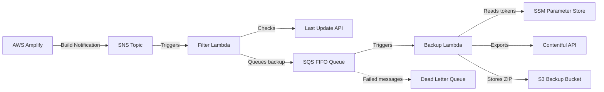

# Design Document: Project Quality Overhaul

## Overview

This design addresses a comprehensive quality overhaul of the event-driven Contentful backup system. The system consists of two AWS Lambda functions, a CloudFormation template, and build/deploy scripts. The overhaul resolves 22 identified issues spanning bugs, security vulnerabilities, code quality problems, infrastructure misconfigurations, and documentation gaps — all while preserving existing system behavior (Requirement 0).

The changes are strictly non-functional: no new features are added, no event flows change, and all existing CloudFormation parameters remain backward-compatible. The work is organized into five categories:

1. **Bug Fixes** (Requirements 1–5): Switch fall-through, assignment-vs-comparison, missing returns, undeclared variables, deployment status checks.
2. **Security Hardening** (Requirements 6–9): Remove env logging, least-privilege IAM, S3 encryption, DLQ for SQS.
3. **Code Quality** (Requirements 10–13): Module-scope SDK init, hasOwnProperty guards, const declarations, sync-fetch removal.
4. **Build & Infrastructure** (Requirements 14–20): Script consolidation, Buffer.from fix, async awaits, template relocation, parameterized names, S3 versioning, SQS visibility timeout.
5. **Documentation** (Requirements 21–22): .env.example, typo fixes.

## Architecture

The system architecture remains unchanged. The overhaul touches internal implementation details only.



### File Structure After Overhaul

```
├── backup-lambda/
│   ├── index.js          # Bug fixes, code quality improvements
│   ├── package.json
│   └── README.md
├── filter-lambda/
│   ├── index.js          # Bug fixes, code quality, sync-fetch removal
│   ├── package.json      # sync-fetch dependency removed
│   └── README.md
├── infrastructure/
│   └── template.yaml     # Moved from deploy/deploy.yaml; security & infra changes
├── deploy/
│   ├── build-lambda.js   # Unified script replacing both build scripts
│   ├── .env.example      # New
│   ├── package.json
│   └── README.md         # Updated references and typo fixes
└── docs/
```

## Components and Interfaces

### 1. Backup Lambda (`backup-lambda/index.js`)

**Changes:**

| Requirement | Change | Rationale |
|---|---|---|
| 1 | Add `break` after each `case` in SSM parsing switch | Prevents fall-through that overwrites management token with delivery token |
| 2 | Change `=` to `===` in `uploadFile` status check | Assignment always evaluates truthy; comparison detects actual failures |
| 3 | Add `return` before `sendResponse()` calls in handler | Handler currently discards response object |
| 10 | Move `require()` and SDK client instantiation to module scope | Enables Lambda execution context reuse across warm invocations |
| 11 | Replace `for(param in ...)` with `for (const param of ...)` or `Object.entries()` | Avoids iterating inherited properties and implicit globals |
| 12 | Change `var response` to `const response` in `sendResponse` | Modern JS best practice; variable is never reassigned |

**Interface (unchanged):**
- Input: SQS event with `Records[0].receiptHandle`
- Output: `{ statusCode: number, body: string }` response object
- Side effects: S3 PutObject, SQS DeleteMessage

### 2. Filter Lambda (`filter-lambda/index.js`)

**Changes:**

| Requirement | Change | Rationale |
|---|---|---|
| 3 | Add `return` before `sendResponse()` calls in handler | Handler currently discards response object |
| 4 | Declare `thisTableUpdate` with `let`; declare loop variable with `const` | Prevents implicit global variable creation |
| 6 | Remove `console.log(process.env)` | Prevents secrets (SQS URL, API URL) from appearing in CloudWatch |
| 10 | Move `require('@aws-sdk/client-sqs')` and `SQSClient` to module scope | Enables execution context reuse |
| 11 | Replace `for(table in json)` with `Object.entries()` or guarded loop | Avoids iterating inherited properties |
| 12 | Change `var response` to `const response` in `sendResponse` | Modern JS best practice |
| 13 | Replace `sync-fetch` with built-in `fetch` + `await` | Node.js 20.x has native fetch; sync-fetch blocks the event loop |

**Interface (unchanged):**
- Input: SNS event with `Records[0].Sns.Message`
- Output: `{ statusCode: number, body: string }` response object
- Side effects: SQS SendMessage

**Note on Requirement 13:** The `getLastUpdateTimestamp` function currently uses synchronous `sync-fetch` and is called without `await`. Converting to async `fetch` requires making `getLastUpdateTimestamp` an `async function` and adding `await` at the call site. The caller already runs inside an `async` handler, so this is straightforward.

### 3. CloudFormation Template (`infrastructure/template.yaml`)

**Changes:**

| Requirement | Change | Rationale |
|---|---|---|
| 7 | Remove `s3:PutObject` from `FilterLambdaRole` | Filter Lambda never writes to S3; least-privilege |
| 8 | Add `BucketEncryption` with SSE-S3 (AES256) to `BackupBucket` | Encryption at rest for backup data |
| 9 | Add DLQ resource + `RedrivePolicy` on `SQSQueue` + IAM permissions | Prevents silent message loss on repeated failures |
| 17 | Move file from `deploy/deploy.yaml` to `infrastructure/template.yaml` | Follows IaC convention per steering rules |
| 18 | Add `BackupLambdaFunctionName` and `FilterLambdaFunctionName` parameters with defaults | Enables multi-environment deployment without naming conflicts |
| 19 | Add `VersioningConfiguration: Status: Enabled` to `BackupBucket` | Protects against accidental overwrites/deletions |
| 20 | Change `VisibilityTimeout` from 450 to 1800 | AWS recommends ≥6× Lambda timeout (300s × 6 = 1800s) |

**New Parameters:**

```yaml
BackupLambdaFunctionName:
  Type: String
  Default: contentful-backup
FilterLambdaFunctionName:
  Type: String
  Default: amplify-notification-filter
```

These parameters replace all hardcoded function name references in resource properties and IAM policy ARNs (log group ARNs).

**New Resources:**

```yaml
DeadLetterQueue:
  Type: AWS::SQS::Queue
  Properties:
    QueueName: contentfulBackupDLQ.fifo
    FifoQueue: true
    MessageRetentionPeriod: 1209600  # 14 days
```

The main `SQSQueue` gets a `RedrivePolicy`:
```yaml
RedrivePolicy:
  deadLetterTargetArn: !GetAtt DeadLetterQueue.Arn
  maxReceiveCount: 3
```

### 4. Unified Build Script (`deploy/build-lambda.js`)

**Changes:**

| Requirement | Change | Rationale |
|---|---|---|
| 14 | Single script accepting CLI argument (`backup` or `filter`) | Eliminates duplication between two nearly-identical scripts |
| 15 | Use `Buffer.from()` instead of `new Buffer.from()` | `new Buffer()` is deprecated; `Buffer.from()` is the static factory |
| 16 | `await` the `updateLambda()` call; wrap in async IIFE or top-level await | Ensures errors propagate and process exits with correct code |

**Interface:**
```bash
node build-lambda.js backup   # Packages and deploys backup-lambda
node build-lambda.js filter   # Packages and deploys filter-lambda
node build-lambda.js          # Shows usage message
```

**Configuration mapping:**

| Argument | Lambda Path | Env Var for Function Name | Zip Filename |
|---|---|---|---|
| `backup` | `../backup-lambda/` | `BACKUP_LAMBDA_FUNC_NAME` | `backup-lambda.zip` |
| `filter` | `../filter-lambda/` | `FILTER_LAMBDA_FUNC_NAME` | `filter-lambda.zip` |

### 5. Documentation Changes

| Requirement | File | Change |
|---|---|---|
| 21 | `deploy/.env.example` | New file with placeholder values for all required env vars |
| 22 | `deploy/README.md` | Fix "it's dependencies" → "its dependencies" (2 occurrences) |
| 17 | `deploy/README.md` | Update CloudFormation template path reference to `infrastructure/template.yaml` |
| 14 | `deploy/README.md` | Update build script instructions to reference unified `build-lambda.js` |

## Data Models

No data model changes. All existing data structures are preserved:

### SSM Parameter Response (consumed by Backup Lambda)
```javascript
// ssmParameters.Parameters[n] shape:
{
  ARN: string,    // Matches MANAGEMENT_TOKEN_ARN or DELIVERY_TOKEN_ARN env var
  Value: string   // The decrypted token value
}
```

### SQS Message (produced by Filter Lambda, consumed by Backup Lambda)
```javascript
{
  QueueUrl: string,
  MessageBody: string,                    // "Backup needed; data last updated at {timestamp}"
  MessageDeduplicationId: "backup",       // Fixed value for FIFO dedup
  MessageGroupId: "backup"               // Fixed value for FIFO ordering
}
```

### Lambda Response Object (produced by sendResponse in both Lambdas)
```javascript
{
  statusCode: number,  // 200 or 500
  body: string         // Human-readable status message
}
```

### Last Update API Response (consumed by Filter Lambda)
```javascript
// JSON object where keys are table names, values have lastUpdatedAt:
{
  [tableName: string]: {
    lastUpdatedAt: string  // ISO 8601 timestamp
  }
}
```

### S3 Object Key Convention (produced by Backup Lambda)
```
{YYYY}/{MM}/{DD}/{YYYY-MM-DD}_{HH-mm-ss.sssZ}.zip
```
Example: `2024/01/15/2024-01-15_14-30-00.000Z.zip`

### .env.example Format
```
AWS_PROFILE_NAME=your-profile-dev
BACKUP_LAMBDA_FUNC_NAME=contentful-backup
FILTER_LAMBDA_FUNC_NAME=amplify-notification-filter
```


## Correctness Properties

*A property is a characteristic or behavior that should hold true across all valid executions of a system — essentially, a formal statement about what the system should do. Properties serve as the bridge between human-readable specifications and machine-verifiable correctness guarantees.*

### Property 1: SSM token parsing assigns each token to its correct variable

*For any* pair of distinct management and delivery token values in an SSM parameter response (in any order), parsing the response should assign the management token value exclusively to `contentfulManagementToken` and the delivery token value exclusively to `contentfulDeliveryToken`.

**Validates: Requirements 1.1, 1.2**

### Property 2: Upload status check returns true only for HTTP 200

*For any* HTTP status code returned in an S3 PutObject response metadata, the `uploadFile` function should return `true` if and only if the status code is exactly `200`.

**Validates: Requirements 2.1, 2.2**

### Property 3: S3 object key format is deterministic and correct

*For any* valid JavaScript `Date` object, the generated S3 key path and ZIP filename should match the pattern `YYYY/MM/DD/YYYY-MM-DD_HH-mm-ss.sssZ.zip` where the date components correspond to the input Date's UTC values.

**Validates: Requirements 0.3**

### Property 4: Filter Lambda SUCCEED check

*For any* string, the `processMessageAsync` function should return `true` if and only if the string contains the substring `"SUCCEED"`.

**Validates: Requirements 0.6**

### Property 5: Object iteration processes only own properties

*For any* JavaScript object (potentially with inherited prototype properties), the SSM parameter parsing loop and the last-update-timestamp iteration should only process the object's own enumerable properties, ignoring any inherited properties.

**Validates: Requirements 11.1, 11.2**

### Property 6: getLastUpdateTimestamp returns the most recent timestamp

*For any* non-empty JSON object where each value contains a `lastUpdatedAt` ISO timestamp string, `getLastUpdateTimestamp` should return a Date equal to the maximum `lastUpdatedAt` value across all entries.

**Validates: Requirements 13.1**

### Property 7: Build script config selection maps arguments to correct Lambda configuration

*For any* valid Lambda identifier argument (`"backup"` or `"filter"`), the unified build script should select the corresponding Lambda source path, environment variable name for the function name, and zip filename.

**Validates: Requirements 14.1, 14.3**

### Property 8: Build script deployment status check returns success only for HTTP 200

*For any* HTTP status code in a Lambda API response, the `updateLambda` function should report success if and only if the status code is exactly `200`.

**Validates: Requirements 5.1, 5.2**

### Property 9: CloudFormation template uses no hardcoded Lambda function names outside parameter defaults

*For any* resource property or IAM policy ARN in the CloudFormation template that references a Lambda function name, the reference should use a parameter (`!Ref` or `!Sub` with parameter) rather than a hardcoded string literal.

**Validates: Requirements 18.2**

### Property 10: sendResponse produces a well-formed response object

*For any* status code (number) and body (string), `sendResponse` should return an object with exactly `statusCode` equal to the input status and `body` equal to the input body.

**Validates: Requirements 3.1, 3.2, 12.1, 12.2**

## Error Handling

### Backup Lambda

| Scenario | Current Behavior | After Overhaul |
|---|---|---|
| SSM parameter with unknown ARN | Falls through switch, may corrupt token variables | Skipped silently (no matching case + break) |
| S3 upload returns non-200 | Assignment `= 200` always truthy → upload "succeeds" | Strict comparison `=== 200` correctly detects failure |
| S3 upload failure | SQS message deleted despite failure (due to bug above) | SQS message retained; handler returns 500 response |
| Repeated SQS processing failures | Message disappears after retention period | Message routed to DLQ after 3 attempts |
| General exception in handler | Logged via `console.error`, response discarded | Logged via `console.error`, error response returned |

### Filter Lambda

| Scenario | Current Behavior | After Overhaul |
|---|---|---|
| Fetch of last-update API fails | Synchronous exception from sync-fetch | Async rejection caught by try/catch, re-thrown |
| API returns object with prototype pollution | Inherited properties iterated, may corrupt timestamp | Only own properties iterated via Object.entries() |
| SQS SendMessage fails | Response discarded | Error response returned from handler |

### Unified Build Script

| Scenario | Current Behavior | After Overhaul |
|---|---|---|
| Invalid or missing CLI argument | Undefined behavior (reads undefined env var) | Usage message displayed, process exits |
| Lambda API call fails | Unhandled promise rejection (no await) | Error caught, logged, process exits with non-zero code |
| Non-200 Lambda API response | Backup script: truthy check passes (no `=== 200`) | Strict equality check correctly reports failure |

### CloudFormation / Infrastructure

| Scenario | Current Behavior | After Overhaul |
|---|---|---|
| SQS message processing fails repeatedly | Message lost after 15-minute retention | Message moved to DLQ after 3 receive attempts; DLQ retains for 14 days |
| Backup object accidentally overwritten | No protection | S3 versioning preserves previous versions |
| Duplicate SQS processing due to visibility timeout | Possible with 450s timeout (< 6× Lambda timeout) | 1800s timeout prevents duplicate processing |

## Testing Strategy

### Dual Testing Approach

This overhaul uses both unit tests and property-based tests for comprehensive coverage:

- **Property-based tests** verify universal correctness properties (Properties 1–10 above) across many randomly generated inputs using a PBT library.
- **Unit tests** verify specific examples, edge cases, integration points, and structural requirements that aren't amenable to property-based testing.

### Property-Based Testing Configuration

- **Library**: [fast-check](https://github.com/dubzzz/fast-check) — the standard PBT library for JavaScript/Node.js
- **Minimum iterations**: 100 per property test
- **Test runner**: Node.js built-in test runner (`node --test`) or Jest (whichever is already available)
- **Tag format**: Each property test must include a comment: `// Feature: project-quality-overhaul, Property {N}: {title}`
- **Each correctness property must be implemented by a single property-based test**

### Property Test Plan

| Property | Test Description | Generator Strategy |
|---|---|---|
| 1: SSM token parsing | Generate random token pairs + random parameter order | `fc.record({ mgmt: fc.string(), delivery: fc.string() })` with shuffled array |
| 2: Upload status check | Generate random HTTP status codes | `fc.integer({ min: 100, max: 599 })` |
| 3: S3 key format | Generate random Dates | `fc.date()` filtered to valid range |
| 4: SUCCEED check | Generate random strings, some containing "SUCCEED" | `fc.string()` and `fc.constant("SUCCEED")` mixed |
| 5: Own-property iteration | Generate objects with prototype-inherited properties | `fc.dictionary()` with prototype manipulation |
| 6: Latest timestamp | Generate JSON objects with random ISO timestamps | `fc.dictionary(fc.string(), fc.record({ lastUpdatedAt: fc.date().map(d => d.toISOString()) }))` |
| 7: Build config selection | Generate from valid identifiers | `fc.constantFrom("backup", "filter")` |
| 8: Build deployment status | Generate random HTTP status codes | `fc.integer({ min: 100, max: 599 })` |
| 9: No hardcoded names in CFN | Parse template, scan all string values | Static analysis test (single run, not randomized — but validates the property) |
| 10: sendResponse shape | Generate random status codes and body strings | `fc.integer(), fc.string()` |

### Unit Test Plan

Unit tests cover the structural, example-based, and edge-case requirements not suited to property-based testing:

| Requirement | Test |
|---|---|
| 0.2 | Verify Contentful export options object has exact expected keys/values |
| 0.4 | Verify SQS message uses `MessageDeduplicationId: "backup"` and `MessageGroupId: "backup"` |
| 0.5 | Verify CloudFormation template retains all original parameter names and types |
| 0.7 | Verify SQS delete is called only after successful S3 upload (mock-based) |
| 1.3 | Verify unknown ARN in SSM response is skipped (edge case) |
| 3.1, 3.2 | Verify handler returns sendResponse result (mock-based) |
| 7.1 | Verify FilterLambdaRole has no s3:PutObject permission (YAML parse) |
| 8.1 | Verify BackupBucket has BucketEncryption configured (YAML parse) |
| 9.1–9.3 | Verify DLQ resource, RedrivePolicy, and IAM permissions exist (YAML parse) |
| 13.3 | Verify filter-lambda package.json has no sync-fetch dependency |
| 14.4 | Verify build script shows usage message with no/invalid args (edge case) |
| 16.2 | Verify build script exits non-zero on Lambda API failure |
| 17.1 | Verify template file exists at infrastructure/template.yaml |
| 18.1 | Verify CloudFormation parameters for function names with correct defaults |
| 19.1 | Verify BackupBucket has VersioningConfiguration enabled |
| 20.1 | Verify SQS VisibilityTimeout ≥ 1800 |
| 21.1–21.2 | Verify .env.example exists with all required variables |
| 22.1 | Verify README contains "its dependencies" not "it's dependencies" |

### Test File Organization

```
tests/
├── backup-lambda/
│   ├── ssm-parsing.property.test.js    # Property 1
│   ├── upload-file.property.test.js    # Property 2
│   ├── s3-key-format.property.test.js  # Property 3
│   ├── send-response.property.test.js  # Property 10
│   ├── own-property.property.test.js   # Property 5 (backup side)
│   └── handler.unit.test.js            # Unit tests for handler behavior
├── filter-lambda/
│   ├── succeed-check.property.test.js  # Property 4
│   ├── latest-timestamp.property.test.js # Property 6
│   ├── own-property.property.test.js   # Property 5 (filter side)
│   └── handler.unit.test.js            # Unit tests for handler behavior
├── deploy/
│   ├── config-selection.property.test.js # Property 7
│   ├── deploy-status.property.test.js  # Property 8
│   └── build-script.unit.test.js       # Unit tests for build script
└── infrastructure/
    ├── template.property.test.js       # Property 9
    └── template.unit.test.js           # Unit tests for CloudFormation template
```

Note: To make Lambda functions testable, the key logic (SSM parsing, upload status checking, S3 key generation, sendResponse, getLastUpdateTimestamp, processMessageAsync, config selection) should be extracted into exportable functions. The refactoring must not change any behavior — only expose existing logic for testing.
